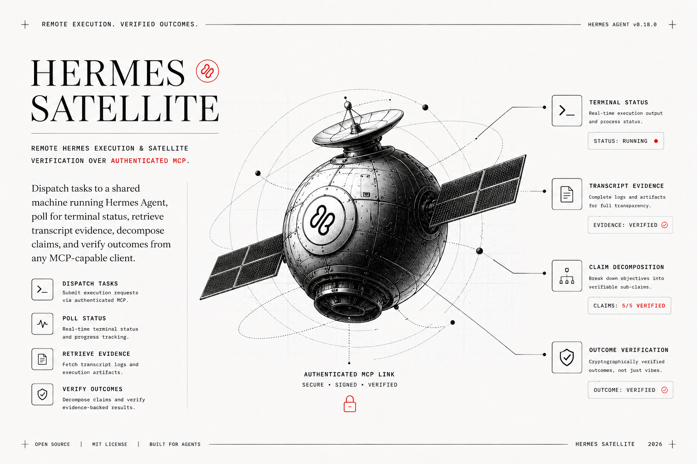
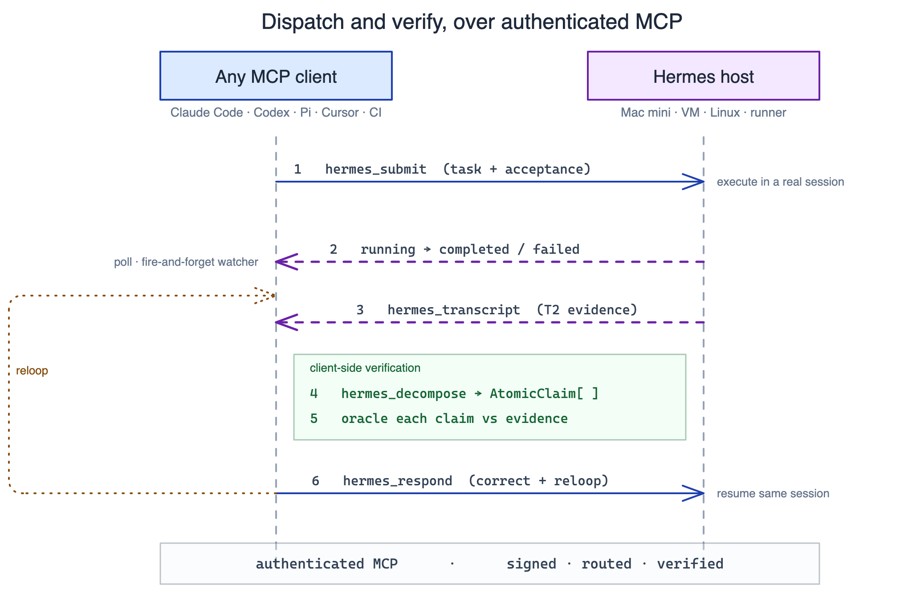

<div align="center">



<h1>Hermes Satellite</h1>

**Your agent finished. But did it actually do the work, or just say it did?**

Remote Hermes execution and satellite verification over authenticated MCP.

[](LICENSE)
[](https://modelcontextprotocol.io)
[](#)
[](#contributing)

</div>

---

## The problem

You hand a long-running task to a coding agent and walk away. Twenty minutes later it reports `done`.

Now what? You have a paragraph of confident prose and no way to know if it's true. So you do the thing that erases the whole point of delegating: you sit and read every line it wrote, because **an agent's summary of its own work is a claim, not proof.** A loop that trusts its own "done" ships code you never saw and never understood, and the faster it runs, the wider that gap grows.

The usual fixes make it worse. Watch it run in the foreground and you're back to babysitting. Trust it blindly and you're merging vibes. Bolt on a reviewer that shares the executor's context and machine, and you've hired a second optimist to grade the first one's homework.

## The insight

> **The thing that checks the work must not be the thing that did the work - and the cleanest way to guarantee that is to put a network between them.**

Move the executor onto its own machine. Let any MCP-capable client dispatch to it, then pull back the *transcript*, break the outcome into atomic claims, and oracle each claim against real evidence before trusting a word. The trust boundary becomes a network boundary you can place an independent verifier across.

That's Hermes Satellite: **loop engineering fused with the verifier-agent pattern, distributed over MCP.**

## What it does

Point a dedicated host - Mac mini, Linux box, VM, homelab server, CI runner - at Hermes Agent, expose it over an authenticated MCP bridge, and any client on any machine gets a shared remote executor with a verification loop wrapped around it.

<div align="center">



</div>

The executor is genuinely separable from the verifier - separable enough to run a **different model family** on each side. Distribution is the scale axis; the oracle is the trust axis; MCP is what lets both move without collapsing back into one box.

## Why it's different

Every loop tool in the wild is single-box: one harness, one machine, one session, verifying its own work over a local socket. Hermes Satellite is the first to put the verifier on the other side of a network from the executor.

| | A plain agent loop | Hermes Satellite |
|---|---|---|
| **Completion** | Prose: "done, looks good" | Atomic claims, each oracled against evidence |
| **Reviewer** | Same session, same blind spots | Independent client, can be a different model family |
| **Trust boundary** | Process boundary (or none) | Network boundary you place a verifier across |
| **Confidence** | Vibes | Clamped in code by evidence tier (T0→T3) |
| **Cost** | Invisible, often unreconciled $0 | `TaskCostSnapshot` surfaced; MoA flagged as unreconciled |
| **Presence while away** | Babysit the terminal, or fly blind | Zero-token watcher taps you only on state change |

## The assurance model: a colleague, not a black box

Fire-and-forget for you - never silent. Hand off the task, keep working. A background watcher (`skills/hermes-dispatch/tools/hermes_watch.py`) polls in **pure deterministic code, zero tokens, zero LLM calls**, and interrupts only on a state change worth your attention:

- **`done`** - terminal status, with the result pulled and ready to verify.
- **`stuck`** - past the 600s cap, likely timed out.
- **`not responding`** - five consecutive failed checks (a sustained outage, not one relay blip), followed by a **`RECOVERED`** line the moment contact resumes.
- **sparse heartbeats** - a quiet "still alive, no action needed" so silence never reads as success.

The design rule, stated plainly: **presence = free code, judgment = the model, only at result and decision points.** Watching a loop run was solving the wrong problem. The task is gone; the watcher taps you on the shoulder on transition.

## Quick start

**Current self-hosted installation requires a local clone.** The bridge runs from this repository; a clone-free installer and the managed service are planned, not available today.

```bash
git clone https://github.com/AojdevStudio/hermes-satellite.git
cd hermes-satellite
```

**On the Hermes host** - run the bridge (native Python FastMCP over Streamable HTTP):

```bash
# bind to a private tailnet / VPN address, never a public interface
export HERMES_ASYNC_BRIDGE_TOKEN="$(openssl rand -hex 32)"
python3 apps/hermes-async-bridge/hermes_async_bridge.py
```

The bridge refuses a blind `0.0.0.0` HTTP bind, requires the bearer token unless in stdio/test mode, and persists task state in `$HERMES_HOME/async_bridge.db`.

**On any client machine** - point an MCP client at it by URL, not a local command. Export `HERMES_MCP_TOKEN` first, then use the one-liner for your client; the YAML remains for clients configured by file:

```bash
export HERMES_MCP_TOKEN="<bridge-token>"
claude mcp add --transport http hermes-async http://<bridge-host>:8081/mcp --header "Authorization: Bearer ${HERMES_MCP_TOKEN}"
codex mcp add hermes-async --url http://<bridge-host>:8081/mcp --bearer-token-env-var HERMES_MCP_TOKEN
```

```yaml
mcp_servers:
  hermes_async:
    url: "http://<bridge-host>:8081/mcp"     # your Tailscale / LAN IP
    headers:
      Authorization: "Bearer ${HERMES_MCP_TOKEN}"
    timeout: 180
    connect_timeout: 60
```

Restart the client so MCP discovery runs, then verify auth **from a separate tailnet node** (the bridge host often cannot curl its own Tailscale IP):

```
no-token   MCP initialize  →  HTTP 401
bearer     MCP initialize  →  HTTP 200
```

When the `hermes_*` tools appear with your client's prefix (`mcp__hermes-async__hermes_submit` in Claude Code, `mcp_hermes_async_*` in Hermes Agent), you're live.

## The verification loop

The `hermes-dispatch` skill is the operational heart. Install it into any skills-aware agent (Claude Code, Codex, Cursor, OpenCode, and the rest) straight from this repo:

```bash
npx skills add aojdevstudio/hermes-satellite
```

You are the **dispatcher and the satellite verifier, never the worker**:

1. **`hermes_submit`** a scoped prompt carrying a `## Acceptance` block - one testable requirement per bullet. These become deterministic claims at verify time; without them the verifier is guessing.
2. **Poll** the contract (30s initial, 120s interval, 600s hard cap) - or launch the watcher and keep working.
3. **`hermes_transcript`** for T2 evidence. The result paragraph is a claim; the transcript is proof.
4. **`hermes_decompose`** the transcript into `AtomicClaim[]`.
5. **Oracle each claim** read-only against tool evidence - never on prose alone.
6. **`hermes_respond`** with corrections and reloop, until verified or `max_loops` is hit.

Confidence is not a vibe - it's clamped in code by how strong the evidence actually is:

| Tier | Evidence | Confidence ceiling |
|------|----------|--------------------|
| **T0** | Result text only | `PARTIAL` |
| **T1** | Session summaries | `VERIFIED` |
| **T2 / T3** | Full transcript / forced-output | `PERFECT`-eligible |

Any task that writes files or executes code **requires T2**. A verify pass that stops at the result paragraph grades `PARTIAL` at best. Cost is part of the contract too: `hermes_result` and `hermes_task_cost` surface real spend, and mixture-of-agents rows with unreconciled local cost are reported as **unknown, never a free $0**.

## Watching the bridge from the host: `hst`

`scripts/hst.ts` is the host operator view for the async bridge. It is a single-file Bun CLI over `~/.hermes/async_bridge.db`, opened read-write only so WAL-mode SQLite is happy, then locked with `PRAGMA query_only=ON` so the CLI stays read-only. Symlink it onto your PATH as `hst` (and/or `hermes-satellite`) and install the companion skill where you dispatch from:

```bash
npx skills add aojdevstudio/hermes-satellite
```

First five minutes on the host:

```text
hst health                 service, port, and recent activity
hst tasks -n 10            recent queue with status, caller, and gist
hst task <id-prefix>       one task in full: runs, cost, timeline, result
hst costs -n 10            per-task snapshots with caller and honest cost
hst watch [id-prefix]      live event stream; exits on terminal status with an id
```

Other useful views: `hst events [-n N] [id-prefix]`, `hst transcript <id-prefix>`, and `hst logs [-f]`. `--json` works on `tasks`, `task`, `events`, and `costs`; JSON mode never calls a gist provider. If the bridge DB cannot be opened, `hst` exits with one line: `hst: cannot open bridge db`.

Real host output, generated with `NO_COLOR=1 bun scripts/hst.ts tasks -n 4`:

```text
 HERMES SATELLITE  · tasks · ~/.hermes/async_bridge.db

┌──────────┬─────────────┬─────────┬───────────────────────┬─────────────┬────────┬────────────────────────────────────┐
│ id       │ status      │ profile │ caller                │         age │   took │ gist                               │
├──────────┼─────────────┼─────────┼───────────────────────┼─────────────┼────────┼────────────────────────────────────┤
│ 7cb13ab6 │ ✓ completed │ default │ obi-orinsync-db-fix   │ 12h 50m ago │ 7m 45s │ Fix OrinSync's unreachable Supaba… │
│ 670a4da6 │ ✓ completed │ default │ obi-micstay-issue17   │ 17h 34m ago │ 8m 55s │ Build MicStay Settings window and… │
│ c4a87ad6 │ ✓ completed │ default │ followup              │ 17h 44m ago │ 9m 52s │ Finish and land output-pin implem… │
│ 6e4e4653 │ ✓ completed │ default │ obi-section-driver-65 │ 17h 46m ago │  2m 3s │ Classify hymns with semantic reas… │
└──────────┴─────────────┴─────────┴───────────────────────┴─────────────┴────────┴────────────────────────────────────┘

  ✓ completed 111  ·  ✗ failed 14
```

Two behaviors worth knowing:

**Gists, not prompt dumps.** `hst tasks` shows each task as a short LLM-generated gist, eight words or fewer. It uses Groq `llama-3.1-8b-instant` when `GROQ_API_KEY` is set in the environment or `~/.hermes/.env`, else OpenRouter `meta-llama/llama-3.3-70b-instruct:free` when `OPENROUTER_API_KEY` is set; `HST_GIST_MODEL` overrides the model. Summaries are cached at `~/.hermes/cache/hst_summaries.json` with one batched call per new task ever. No key, timeout, network failure, or OpenRouter 429 falls back to the raw prompt silently; a later run self-heals when the provider works. OpenRouter `:free` endpoints require account privacy settings that permit them.

**Honest cost rendering.** The same rule as the verification loop: `$0` on a subscription-billed session renders as `$0 (subscription)`; any other `$0` renders as `unknown` - never free. This applies to `hst costs` and the per-loop cost lines in `hst task`.

| Variable | Used for |
|----------|----------|
| `HERMES_ASYNC_BRIDGE_DB` | Override the bridge DB path; default is `~/.hermes/async_bridge.db`. |
| `HERMES_HOME` | Override the Hermes home; controls the default DB, `.env`, and gist cache paths. |
| `GROQ_API_KEY` | Preferred gist provider key, from env or `~/.hermes/.env`. |
| `OPENROUTER_API_KEY` | Fallback gist provider key, from env or `~/.hermes/.env`. |
| `HST_GIST_MODEL` | Override the selected gist model. |
| `NO_COLOR` | Disable ANSI color for docs, logs, and scripts. |

## What's in the repo

| Path | What it is |
|------|-----------|
| `apps/hermes-async-bridge/` | Native Python Streamable HTTP MCP bridge for Hermes Agent |
| `apps/verifier/hermes/` | TypeScript client - dispatch, polling, transcript, decomposition |
| `skills/hermes-dispatch/` | The dispatch + satellite-verify skill, plus the zero-token watcher |
| `scripts/hst.ts` | `hst` - read-only host-side observability CLI: tasks, costs, events, transcripts, health |
| `hermes-mcp.md` | Bridge architecture and operational state |
| `hermes-polling.md` | The normative client polling contract |
| `specs/hermes-satellite-verify.md` | Implementation plan and the evidence / cost model |
| `ROADMAP.md` | Phased path from bridge foundation to the fully verified loop |

<div align="center">


</div>

## The story

This started with a non-engineer breaking a bash `while` loop down from first principles instead of borrowing someone else's - trying to actually understand what a loop *is* before wiring agents into one. That path ran straight into two of 2026's loudest ideas: **loop engineering** (design the system around the agent, don't prompt it turn by turn) and the **verifier-agent pattern** (a second agent that decomposes work into atomic claims and proves each one, because an agent grading itself shares its own blind spots).

Every implementation of both lived on a single box. The realization that became this repo: put a network between the executor and the verifier, and the choice between in-loop and on-event verification stops being an architecture you bake in - it becomes a per-task knob you set at dispatch. That's the satellite. Two reading threads, finally meeting in one artifact.

## Credits and lineage

The thinking here isn't mine alone. Hermes Satellite is where a handful of other people's ideas met, and they deserve the credit:

- **[AI Jason](https://www.youtube.com/@AIJasonZ) (Jason Zhou)** for loop engineering, the inner/outer-loop split, and compounding loops through a shared artifact system. His [loop-engineer-template](https://github.com/JayZeeDesign/loop-engineer-template) is where a lot of it got concrete for me.
- **[Peter Steinberger](https://steipete.me)** for "you should be designing loops that prompt your agents." His [agent-scripts](https://github.com/steipete/agent-scripts) orchestrator and skills are the shape I kept coming back to.
- **[IndyDevDan](https://www.youtube.com/@indydevdan) (Dan Disler)** for the verifier-agent pattern: decompose the work into atomic claims and prove each one. This repo grew out of his [the-verifier-agent](https://github.com/disler/the-verifier-agent), and the satellite is that pattern pushed across a network.
- **[Matt Pocock](https://www.aihero.dev)** whose [`/teach` skill](https://github.com/mattpocock/skills) is what helped me actually work out my own ideas for how I wanted to build loops, instead of copying someone else's.

Built on:

- **[Hermes Agent](https://github.com/NousResearch/hermes-agent) by Nous Research**, the self-improving agent that does the real work on the host side. The satellite dispatches to it and verifies what it did.
- **[FastMCP](https://github.com/jlowin/fastmcp)**, the Pythonic MCP framework the authenticated bridge is built on.

## Roadmap

- ✅ Native authenticated HTTP bridge, ten core `hermes_*` tools, polling contract, zero-token watcher
- 🔜 End-to-end callback / wake path from a real satellite verifier client
- 🔜 `hermes_progress` - live sub-step visibility ("finished slice 1 of 3"), not just state transitions
- 🔜 Token-derived principal mapping (beyond caller-string identity)
- ✅ `hst` - read-only host-side CLI for the task queue, costs, events, transcripts, and health
- 🔜 Operator UI beyond the `hst` CLI - callbacks and verification state in one view

See [`ROADMAP.md`](ROADMAP.md) for the full phased plan. Public operations guidance lives in [`docs/docs/safety/`](docs/docs/safety/) and [`docs/docs/operations/`](docs/docs/operations/); run `pnpm docs:validate` before submitting docs changes.

## Contributing

Issues and PRs welcome. Security disclosures: see [`SECURITY.md`](SECURITY.md) - please report privately, don't open a public issue for vulnerabilities.

## License

MIT - see [`LICENSE`](LICENSE).

<div align="center">

**Remote execution. Verified outcomes.**

If an agent's word isn't enough, star the repo and put a satellite on it.

</div>
