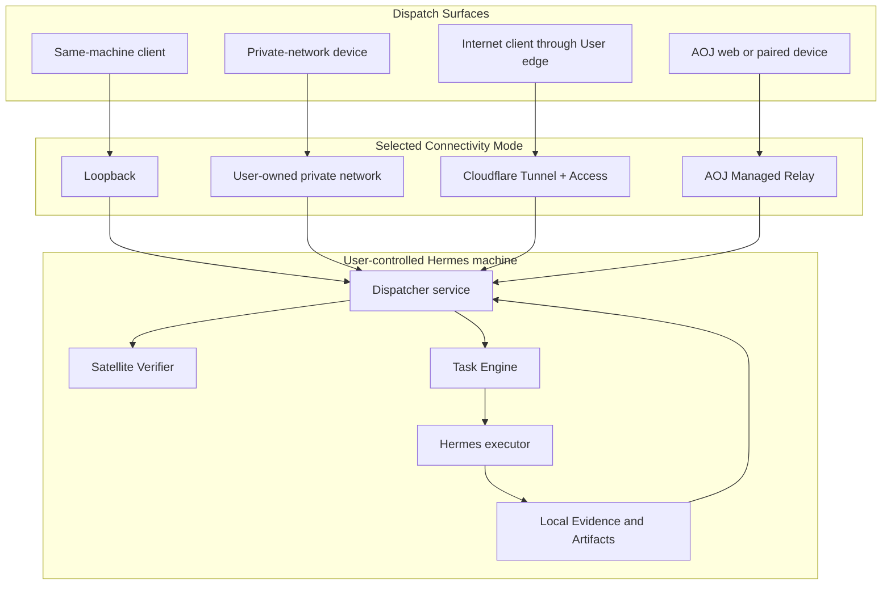

# Four Connectivity Mode contracts

Status: decision-complete planning contract

Date: 2026-07-12

Wayfinder ticket: [Define the four Connectivity Mode contracts](https://github.com/AojdevStudio/hermes-satellite/issues/26)

## Decision

Hermes Satellite has four Connectivity Modes: Local, Private, Public Edge, and Managed. A Connectivity Mode is the installation's user-facing reachability and operations contract. It is not a Commercial Tier and does not change task semantics, verification authority, or where Hermes executes.

Every mode runs the same user-installed core:

- a supervised Dispatcher service;
- an ephemeral Satellite Verifier launched by that Dispatcher;
- a separately supervised Hermes Host service containing the Task Engine and Hermes executor;
- local Task, Evidence, Artifact, transcript, and Cost state.

Remote clients are **Dispatch Surfaces**, not the Dispatcher itself. They submit work and present results. The user-installed Dispatcher owns the task loop and runs the Satellite Verifier locally in every mode. This keeps full transcripts, repositories, terminal streams, and artifact bodies on the User's machine while preserving the Dispatcher/Hermes process and authority boundary.

Connectivity changes only how an authorized Dispatch Surface reaches the Dispatcher:

An installation selects one primary User-facing mode. Authenticated loopback remains available for local health, recovery, and administration. A later networking decision may permit a narrow Private admin path alongside Public Edge or Managed Mode, but that path does not silently create a second public dispatch surface.

## Shared contract across all modes

### User promise

The User can submit work through an authorized Dispatch Surface, observe durable task progress, and receive either:

- a Verified Result paired with an independently authored Verification Report;
- an explicit failed, cancelled, or unverifiable outcome; or
- an honest offline/unavailable state.

No mode equates Hermes execution success with verified completion. No mode claims that a same-machine verifier protects against a compromised Host; the security-invariants ticket owns the assurance wording.

### Execution and verification placement

- Hermes, the Task Engine, primary Evidence storage, and artifact bodies run on the User-controlled Hermes machine.
- The Dispatcher service runs on that machine in a separate process from the Host service.
- The Dispatcher launches the Satellite Verifier as a separate, read-only process/session using the Local Mode authority contract.
- Dispatch Surfaces may be local or remote, but they never receive verifier or Host mutation credentials.
- Corrective work is submitted by the Dispatcher after a verifier report, not by Hermes or the Dispatch Surface.

### Authentication boundary

Every request crosses two independent boundaries:

1. the mode-specific reachability/edge boundary determines whether the Dispatch Surface can reach the Dispatcher;
2. Hermes Satellite authentication maps the caller to a principal authorized for the requested Task operation.

Network location, loopback, private-network membership, Cloudflare Access, or an AOJ login may establish part of identity but never replaces principal-scoped Task authorization. The Dispatcher-to-Host and report-only verifier credentials from the Local Mode contract remain internal and unchanged.

### Evidence and data boundary

The local Dispatcher obtains transcript Evidence and read-only world-state access without moving verification responsibility into Hermes:

- the Host records transcript and execution Evidence through Task Engine Artifact APIs;
- the local verifier receives immutable verification-input Artifacts and read-only oracle tools;
- external world checks such as GitHub, CI, or service APIs use User-authorized read-only credentials where available;
- Host-local checks execute under the verifier's audited read-only tool policy;
- remote Dispatch Surfaces receive Task state, Verification Reports, final responses, and only explicitly authorized Evidence excerpts.

Full transcripts, repositories, terminal streams, and artifact bodies do not cross the selected connectivity provider by default. Changing modes does not migrate or duplicate those bodies.

### Availability and recovery

All modes require the User's machine, Dispatcher service, Host service, and Hermes runtime to be operational for new execution. Durable accepted work survives a client disconnect and service restart according to the Task Engine and Local Mode recovery contracts.

Connectivity failures never change Task Outcome. A Dispatch Surface that cannot reach the Dispatcher reports `offline` or `unavailable`; it does not infer failure or resubmit blindly. Cursor replay and idempotent commands recover after connectivity returns.

### Mode switching

Switching modes changes reachability, edge identity, and Dispatch Surface configuration only. It does not create a new installation, Task Engine, database, Task ID namespace, Evidence store, or verifier policy.

A safe switch must:

1. configure and prove the new path;
2. rotate or add the required mode-specific credentials;
3. preserve local loopback recovery;
4. update paired Dispatch Surfaces;
5. disable the old external path only after the new path passes an authenticated end-to-end smoke;
6. leave existing Tasks and Event cursors intact.

Exact wizard screens, commands, supported platforms, upgrade, and rollback mechanics belong to the installation/lifecycle ticket.

## Mode matrix

| Contract field | Local | Private | Public Edge | Managed |
|---|---|---|---|---|
| User promise | Use Hermes Satellite on this machine with no external service | Reach the installation from the User's enrolled private devices without publishing it to the internet | Reach the installation from anywhere through the User's protected Cloudflare hostname | Sign in and reach the installation from anywhere without owning network or Cloudflare infrastructure |
| Dispatch origins | Same-machine agents, CLIs, and supported local apps | Authorized devices attached to the User-owned private network | Authorized internet devices and agents passing the User-owned Access policy | AOJ first-party web Dispatch Surface and other explicitly paired AOJ-supported devices/agents |
| Required account | None | Account/infrastructure required by the selected private-network provider | User-owned Cloudflare account, zone/hostname, Tunnel, and Access policy | AOJ account only |
| Inbound Host exposure | None; loopback only | No public exposure; private-network reachability to Dispatcher only | No direct inbound port; outbound Tunnel exposes Dispatcher through Access | No direct inbound port; installation establishes outbound Managed Relay connection |
| Edge identity | Local device credential | Private-network identity plus Hermes Satellite principal | Cloudflare Access identity/service token plus Hermes Satellite principal | AOJ account/device pairing plus installation-scoped principal |
| Verifier placement | Local Dispatcher runtime | Local Dispatcher runtime | Local Dispatcher runtime | Local Dispatcher runtime |
| Durable state placement | User machine | User machine | User machine | User machine; AOJ retains only the separately authorized managed control-plane subset |
| Provider dependency | None | User-selected private-network provider | Cloudflare availability and User configuration | AOJ service availability and its infrastructure providers |
| Primary failure signal | Local services/Host unavailable | Host or private path unavailable | Host, tunnel, Access, DNS, or Cloudflare edge unavailable | Host offline, relay disconnected, pairing invalid, or AOJ control plane unavailable |
| Setup responsibility | Installer configures local services and clients | User owns provider account/enrollment; installer guides and validates | User owns Cloudflare/DNS/Access; installer guides and validates | AOJ operates cloud edge; User signs in and pairs installation/devices |

## Local Mode

### Promise

Local Mode is the zero-account default. A User can dispatch and receive locally verified results from the same machine without Cloudflare, Tailscale, DNS, port forwarding, or AOJ infrastructure.

### Reachability and authentication

Dispatch Surfaces connect to the authenticated Dispatcher loopback listener. The Host listener remains a separate authenticated loopback endpoint reachable only by the Dispatcher. Loopback is transport, not identity; local principal credentials remain mandatory.

### Availability

Local Mode works whenever the machine and supervised services are running. It offers no off-machine dispatch. Internet access may still be needed by Hermes or verifier oracle tools for the work itself, but not for Hermes Satellite reachability.

### Setup experience

The installer selects Local by default, creates local credentials, installs both supervised services, and configures supported local Dispatch Surfaces. The first smoke dispatch proves execution, transcript Evidence, verification, and corrective-loop readiness.

The detailed process, credential, recursion, and reboot contract is defined in [Local Mode topology](local-mode-topology.md).

## Private Mode

### Promise

Private Mode lets the User dispatch from enrolled personal devices while the Dispatcher remains unavailable to the public internet.

### Reachability and authentication

A user-owned private network provides reachability to the Dispatcher listener. Provider membership alone is insufficient: the Dispatcher still authenticates and authorizes a Hermes Satellite principal for every Task operation. The Host listener remains local/internal and is never exposed to private devices.

The exact provider, interface binding, name resolution, Access Control List, and admin fallback are owned by [Choose Private and Public Edge networking architecture](https://github.com/AojdevStudio/hermes-satellite/issues/29).

### Availability

The User's machine, private-network path, and enrolled Dispatch Surface must be online. There is no AOJ queue or availability promise. A disconnected client resumes by reading Task state and per-Task Events; it does not create a duplicate Task.

### Setup experience

The installer detects or guides installation of the selected private-network provider, confirms the User controls the network, pairs each Dispatch Surface, and runs an authenticated private-path smoke. The User owns provider billing, membership, and recovery.

## Public Edge Mode

### Promise

Public Edge Mode lets the User dispatch from anywhere through a stable hostname protected by the User's own Cloudflare Tunnel and Access configuration. It remains self-hosted open-source connectivity, not an AOJ-managed service.

### Reachability and authentication

The Dispatcher stays bound to loopback/private origin. `cloudflared` creates the outbound Tunnel; Cloudflare Access authenticates the edge request; the Dispatcher maps the request to a Hermes Satellite principal and applies Task authorization. The Host listener is never tunneled or publicly addressable.

A Worker is not part of the mode contract. [Choose Private and Public Edge networking architecture](https://github.com/AojdevStudio/hermes-satellite/issues/29) may add one only if primary-source research identifies required gateway behavior that Tunnel and Access cannot supply.

### Availability

The User owns the domain, Tunnel, Access policy, origin service, and Cloudflare account. Remote dispatch depends on all of them plus Cloudflare service availability. Hermes Satellite reports which boundary is failing but provides no AOJ service objective or offline queue.

### Setup experience

The installer guides Cloudflare login/authorization, hostname selection, Tunnel installation, Access policy validation, and origin health without asking the User to expose a port or bind blindly to `0.0.0.0`. The User owns ongoing Cloudflare billing, policy, DNS, credential rotation, and recovery.

## Managed Mode

### Promise

Managed Mode lets a User install Hermes Satellite, sign in, pair the machine, and dispatch from anywhere without creating a Cloudflare account, owning a domain, operating a private network, or exposing an inbound port.

### Reachability and authentication

The installation creates an outbound-only connection to the AOJ Managed Relay. AOJ identity and device pairing authorize a Dispatch Surface to route Task control envelopes to one paired installation. The local Dispatcher remains the Task/verification control plane; the relay does not become another Task Engine or verifier.

The first Managed release includes an AOJ first-party web Dispatch Surface. Whether that web surface can connect directly to Local, Private, or Public Edge installations remains owned by [Prototype the first-party web dispatch and verification journey](https://github.com/AojdevStudio/hermes-satellite/issues/31).

### Verification and managed data

The Satellite Verifier runs locally under the User-installed Dispatcher. AOJ routes task prompts, small control envelopes, state changes, final responses, Verification Reports, and intentionally selected small Evidence excerpts. Full transcripts, repositories, terminal streams, verifier scratch, and artifact bodies remain on the User's machine.

This is the Managed v1 privacy and cost baseline. [Define managed identity, pairing, authorization, and data boundaries](https://github.com/AojdevStudio/hermes-satellite/issues/32) must specify encryption, AOJ readability, retention, deletion, revocation, and the exact retained subset without relocating the verifier.

### Availability

Remote dispatch depends on the User's machine and AOJ's identity/relay/control plane. When the installation is offline, the Dispatch Surface shows that state explicitly. The relay may offer bounded offline delivery only if [Design the Managed Relay control plane](https://github.com/AojdevStudio/hermes-satellite/issues/30) proves durable acknowledgement, expiry, backpressure, and idempotent recovery; this contract does not promise unbounded queueing.

AOJ service objectives, support, abuse limits, and incident commitments belong to the managed-support ticket.

### Setup experience

The User installs Hermes Satellite, signs into AOJ, pairs the installation with a short-lived flow, and confirms the outbound relay connection. AOJ owns cloud deployment, certificates, routing, and provider billing. The User owns the Hermes machine, Hermes runtime, local credentials, and local data.

## What does not vary by mode

The following cannot become mode-specific behavior:

- Task, Context, Message, Execution, Artifact, Evidence, Verification Report, Task Event, Subscription, and Cost semantics;
- the distinction between Execution Status, Verification State, and Task Outcome;
- the Dispatcher-owned verifier and Host-owned execution boundary;
- MCP compatibility and A2A task mappings;
- full-Task corrective lineage and cost accounting;
- cancellation, idempotency, cursor replay, restart recovery, and retention integrity;
- the rule that unknown or unreconciled cost never becomes `$0`;
- the requirement that a Verified Result contains a valid Verification Report.

## Acceptance gates

The four-mode contract is implementation-ready only when tests can prove:

1. The same Task fixture produces equivalent lifecycle, Verification Report, and Task Outcome semantics in all modes.
2. Every mode keeps the Host listener unavailable to its Dispatch Surfaces.
3. Local works with all external network interfaces disabled.
4. Private rejects a network member without an authorized Hermes Satellite principal.
5. Public Edge exposes only the Dispatcher through authenticated Tunnel/Access and leaves no direct inbound port.
6. Managed reaches the Dispatcher only through an installation-bound outbound relay connection.
7. The verifier runs locally and can finish a verification pass after the originating remote Dispatch Surface disconnects.
8. Full transcript, repository, terminal, verifier-scratch, and artifact bodies do not cross Cloudflare or AOJ infrastructure by default.
9. A path outage reports offline/unavailable and recovers through existing Task state/Event cursors without duplicate dispatch.
10. Switching modes preserves installation identity, Tasks, Events, Evidence references, Cost Records, and local rollback.
11. No setup path asks the User to bind the Host or Dispatcher blindly to a public wildcard address.
12. Product and setup copy use User and Connectivity Mode terminology, never Customer or Commercial Tier as a synonym.

## Deferred decisions

- Private provider choice, exact binding, ACLs, fallback, and Public Edge Worker necessity: networking architecture ticket.
- Managed relay protocol, Cloudflare services, offline delivery, routing, and backpressure: relay architecture ticket.
- First-party web journey and cross-mode reach: web Dispatcher prototype ticket.
- Account, pairing, cloud readability, encryption, retention, deletion, and verifier scratch policy: managed identity/data ticket.
- Threat model and assurance language: security-invariants ticket.
- Supported platforms, exact setup wizard, upgrades, rollback, and uninstall: installation/lifecycle ticket.
- Commercial entitlements and prices: Commercial Tier ticket.
