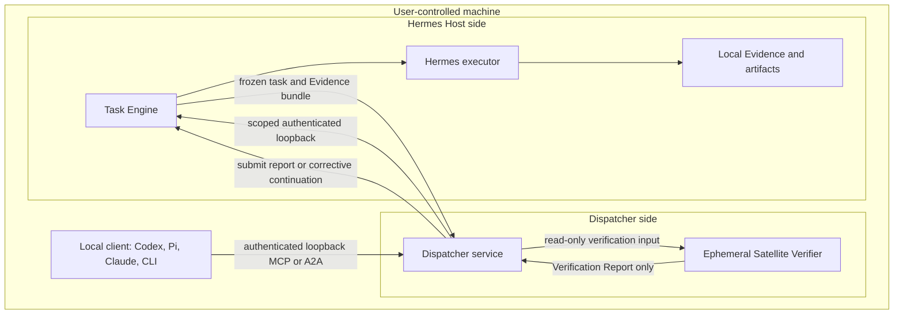

# Local Mode execution and verification topology

Status: decision-complete planning contract

Date: 2026-07-12

Wayfinder ticket: [Define Local Mode execution and verification topology](https://github.com/AojdevStudio/hermes-satellite/issues/28)

## Decision

Local Mode runs the Dispatcher side and Hermes Host side on one User-controlled machine, but in separate supervised processes with separate credentials and authority.

The minimum topology is:

1. a long-lived **Dispatcher service** that owns the local client surface, verification coordination, corrective-loop policy, and recovery cursor;
2. a long-lived **Hermes Host service** that owns the Task Engine, durable execution queue, Hermes subprocesses, and host-produced Evidence;
3. an ephemeral **Satellite Verifier process/session** spawned by the Dispatcher for each verification pass with a read-only tool allowlist and no dispatch credential.

Local clients connect only to the Dispatcher service. The Dispatcher connects to the Hermes Host service over authenticated loopback. Both long-lived services survive reboot through the native service manager. The Satellite Verifier can be recreated from a durable verification-input Artifact and Task Trace, so it does not need its own daemon or database.

Physical co-location changes latency and transport only. It does not move the Satellite Verifier under Hermes or allow Hermes to verify its own work.

## Why this is the minimum topology

The current repository already has the three necessary execution contexts in partial form:

- launchd supervises the async bridge with `RunAtLoad=true` and `KeepAlive=true`;
- the bridge owns task persistence, starts Hermes subprocesses, exports transcript Evidence, and requires bearer authentication;
- the dispatch skill and `onHermesTerminalStatus` keep verification and corrective policy on the Dispatcher side;
- the existing verifier launcher already proves a verifier can be spawned with an explicit tool allowlist;
- the resident Local Pi Verifier is a separate product path and must not be reused as the Satellite Verifier.

The target adds one durable Dispatcher service because verified asynchronous work must continue after the originating client exits or the machine reboots. It does not add containers, a second database, a local message broker, Unix-socket support, or an external account.

## Process and authority boundaries

| Execution context | Lifetime | May do | Must not do |
|---|---|---|---|
| Local client | interactive/transient | create, observe, continue, and cancel its authorized Tasks through Dispatcher adapters | call the Host service directly; claim unverified Hermes output is verified |
| Dispatcher service | supervised/long-lived | authenticate clients, map MCP/A2A, follow Task Events, invoke verifier passes, submit reports, request corrective Executions | run Hermes; author verifier judgment; directly mutate Task Engine storage |
| Satellite Verifier | ephemeral per pass | read its frozen verification input, use approved read-only oracle tools, return a structured Verification Report | create/continue/cancel Tasks; call Hermes; receive Dispatcher or Host mutation credentials; write to the target workspace |
| Hermes Host service | supervised/long-lived | own Task Engine state, lease Executions, run Hermes, capture result/Evidence/cost, serve authorized internal operations | expose a Verified Result without a valid Dispatcher-owned report; invoke itself as Dispatcher |
| Hermes subprocess | ephemeral per Execution | perform the dispatched work within its profile | inherit Dispatcher credentials; submit work back to its own installation through authorized APIs; author Verification Reports |

The Dispatcher service brokers the verifier's structured output to the Task Engine using a report-only credential that identifies the Satellite Verifier principal. The report records the verifier process/session identity, verification-input Artifact ID/digest, policy version, and pass idempotency key. This preserves authorship and authorization without giving the ephemeral process a network credential or Task mutation authority.

## Listener boundary

Local Mode uses two distinct loopback-only HTTP listeners:

- **Dispatcher listener:** the only endpoint local clients configure; exposes MCP compatibility and the Dispatcher-fronted A2A surface.
- **Host listener:** an internal endpoint used only by the Dispatcher service for Task Engine operations and Evidence access.

Both bind to `127.0.0.1`, never `0.0.0.0`, `::`, a LAN address, or the machine's own tailnet address. Exact ports remain installer-owned configuration so existing services are not displaced.

Loopback HTTP is deliberate: the repository already uses native authenticated HTTP, health checks, and MCP Streamable HTTP. A new Unix-socket transport would add code without changing the Local Mode trust boundary. It can be reconsidered only if measured loopback overhead or local port management becomes a real problem.

The current Tailscale-only bridge at `100.66.249.14:8081` is evidence of the existing deployment, not the Local Mode endpoint. Local Mode reuses the same service behavior behind loopback rather than proxying through the host's tailnet address.

## Local authentication and principals

Loopback is not treated as identity. Authentication remains mandatory.

Local setup generates and stores three installation-scoped credentials:

1. a client-to-Dispatcher credential scoped to the User/device principal;
2. a Dispatcher-to-Host control credential scoped to the Dispatcher service principal;
3. a Dispatcher-held report credential scoped only to `submitVerificationReport` and identifying the Satellite Verifier principal.

The ephemeral Satellite Verifier and Hermes subprocess receive none of these credentials. Secrets are injected into only the long-lived process that needs them and are omitted from Hermes/verifier child environments. This prevents accidental inheritance and ordinary self-dispatch; it is not an adversarial isolation claim against same-user processes on a compromised Host. A caller-supplied `caller` string remains display metadata and never grants access.

The Host authorizes operations by principal role:

| Principal role | Allowed Host operations |
|---|---|
| Dispatcher control principal | create/continue/cancel authorized Tasks, read Task state and Events, read authorized Evidence descriptors/bodies |
| Satellite Verifier principal, brokered by Dispatcher | submit an attributed Verification Report only |
| Hermes executor | claim/update its leased Execution, record result, Evidence, and Cost Records |
| Ephemeral verifier process | no direct Host access in Local Mode |
| Local client | no direct Host access in Local Mode |

Exact credential issuance, rotation, and pairing remain owned by the identity and authorization ticket. Local Mode requires these scopes but does not invent another authentication system.

## Verification and Evidence path

The Host produces Evidence; the Dispatcher decides what to verify; the Satellite Verifier judges it.

1. Hermes finishes an Execution and the Host commits its result, transcript Evidence descriptor, Cost Records, and terminal Execution event.
2. The Dispatcher resumes from the Task's Event cursor and requests the authorized Evidence required for verification.
3. The Dispatcher builds and records an immutable verification-input Artifact containing the original intent/acceptance criteria, Hermes result, Evidence IDs/digests, transcript body when authorized, world-check instructions, verifier policy version, pass state, and idempotency key.
4. The Satellite Verifier process receives that recorded bundle plus read-only oracle tools.
5. The verifier returns a structured report: `verified`, `correction_required`, or `unverifiable`.
6. The Dispatcher validates the output shape, attaches process/input provenance, and submits the report to the Task Engine.
7. For `correction_required`, the Dispatcher—not the verifier—creates the corrective Continuation and requests the next Execution.

The Satellite Verifier does not open `async_bridge.db` or Hermes `state.db` directly. Database access remains a Host implementation detail; the Task Engine Evidence API is the contract. Local filesystem/world-state checks occur through a read-only tool allowlist or an auditable pass proving zero mutating calls, matching the existing verification rule.

Full transcripts and artifact bodies stay on the machine. No Cloudflare, relay, or AOJ account participates in Local Mode.

## Read-only verifier enforcement

Read-only means capability restriction plus an auditable trace, not merely an instruction in a prompt.

Required controls:

- the verifier is a separate process/session from Hermes and receives no Hermes conversation context beyond the explicit verification bundle;
- its tool list excludes file write/edit, shell commands capable of mutation, Git mutation, task mutation, and dispatch tools;
- its working scope is restricted to the Task's declared repositories/artifacts;
- every oracle call and result is captured in the verification pass trace;
- a report is rejected if the verifier pass contains a mutating call or if its input digest does not match the recorded bundle;
- corrective text is data inside the report; only the Dispatcher can turn it into a Continuation.

This is meaningful independent verification against ordinary executor error and blind spots. It is not isolation from a malicious or compromised machine owner, kernel, or shared OS account; the assurance-ceiling ticket owns that product wording.

## Self-dispatch recursion safeguards

Accidental self-dispatch is prevented by capability separation rather than a new recursion counter:

- local clients know only the Dispatcher endpoint;
- Hermes and verifier child environments do not inherit Dispatcher or Host mutation credentials;
- the Host rejects Task creation, continuation, and cancellation from executor or verifier principals;
- the Dispatcher rejects an inbound request whose authenticated principal is its own Host executor identity;
- all corrective work must reference the existing active Task and originate from the Dispatcher service;
- the Task Trace records actor principal and causation for every Message and Execution.

These rules stop accidental recursive dispatch during normal operation. Because the current Host uses one OS account, they do not prevent a malicious same-user process from searching for credentials. A User who deliberately gives Hermes the Dispatcher credential—or permits Hermes to escape its tool/profile boundary—has crossed the documented Local Mode trust boundary.

## Durable supervision

On macOS, both long-lived processes are launchd LaunchAgents with:

- `RunAtLoad=true` and `KeepAlive=true`;
- non-interactive startup and no password/keychain prompt;
- explicit `HOME`, state paths, loopback binds, and non-interactive credential sources;
- separate stdout/stderr logs and health status;
- bounded restart backoff so a bad configuration does not spin continuously;
- a versioned installed source path, not a mutable development worktree;
- no dependency on Plex, GitHub Actions runner ports, autofs mounts, or GUI input.

Linux may use equivalent systemd user services later; that does not change the topology.

Start ordering is not a dependency mechanism. Both services may start in either order. The Dispatcher reports Host-unavailable health and retries with bounded backoff until the Host is ready. The Host can execute and persist work while the Dispatcher is restarting because delivery comes from durable Task Events, not an in-memory callback.

## Recovery behavior

Recovery has two independent loops.

### Host recovery

On startup, the Task Engine:

1. opens and migrates its durable store;
2. reconciles queued and orphaned-running Executions through the Task Engine lease rules;
3. records every recovery choice as a Task Event;
4. refuses duplicate worker ownership;
5. exposes health only after the store is usable and recovery has begun.

Cancellation remains terminal where defined and cannot be overwritten by a late Hermes process result.

### Dispatcher recovery

On startup, the Dispatcher:

1. loads its compact durable per-Task cursor map;
2. lists active principal-scoped Tasks and reconciles each current snapshot, including Tasks absent from or newer than the cursor map;
3. replays each Task's Events after that Task's cursor idempotently;
4. finds Tasks awaiting verification, correction, or User input;
5. restarts missing verification passes from their recorded verification-input Artifacts and pass-state Events;
6. resubmits reports and corrections with the recorded original idempotency keys when acknowledgement is uncertain.

The cursor map is a small local Dispatcher state file written atomically; it is not a second task database or source of truth. If it is missing or stale, principal-scoped active-Task reconciliation plus idempotent Task commands recovers safely.

If the Dispatcher dies while Hermes runs, the Host completes and persists the Execution. If the verifier dies, the Task stays `awaiting_verification`; the Dispatcher records the failed pass as a Task Event and retries the recorded input within policy. Neither failure converts an unverified result into a Verified Result.

## Current-to-target migration

| Current deployment | Local Mode target |
|---|---|
| one launchd async bridge bound to a Tailscale IP | Host service bound to authenticated loopback |
| MCP tools directly expose Host lifecycle | local clients call Dispatcher MCP/A2A adapters; Dispatcher calls Host operations |
| one static bearer token and caller strings | separate client/Dispatcher and Dispatcher/Host principals with scoped authority |
| verifier trigger exists but is not wired | supervised Dispatcher consumes durable Events and launches verifier passes |
| verifier correction can call `hermes_respond` inside the loop | verifier returns corrective data; Dispatcher alone continues the Task |
| in-memory threads represent queued work | durable Execution lease/recovery from the Task Engine contract |
| callback/polling is the wake path | durable Event cursor is recovery; streams/callbacks are optional delivery |
| launchd executes source from a mutable worktree | launchd executes a versioned installed artifact with an explicit rollback target |

Migration does not alter the live service during Wayfinder planning. The implementation plan must stage a parallel loopback smoke path and cut over only after it proves existing remote execution, Evidence, and verification behavior.

## Acceptance gates

Local Mode is specified correctly only when implementation tests can prove:

1. A fresh machine can configure Local Mode without Cloudflare, Tailscale, DNS, or an external account.
2. A local MCP or A2A client reaches only the Dispatcher endpoint and receives a Verified Result only after a valid report.
3. The Host and Dispatcher bind only to loopback and reject missing/incorrect credentials.
4. Hermes and verifier child environments inherit no Dispatcher/Host mutation credentials, and the same-user trust ceiling is stated honestly.
5. A verifier pass with a mutating tool call is rejected and cannot close the Task as verified.
6. Hermes cannot create or continue a Task using its executor principal.
7. Killing the client does not stop execution or verification coordination.
8. Killing/restarting the Dispatcher during Hermes execution reconciles active Tasks and resumes from per-Task Event cursors without duplicate correction.
9. Killing/restarting the Host recovers queued/orphaned Executions without loss or double execution.
10. Rebooting the machine restores both services without console interaction and resumes an incomplete Task.
11. Full transcript and artifact bodies remain local while Verification Reports reference their Evidence IDs/digests.
12. Local Mode installation and tests do not stop, rebind, or modify Plex, GitHub Actions runners, the Hermes gateway, autofs, or unattended power settings.

## Deferred boundaries

- Exact setup commands, port allocation, and mode switching belong to the Connectivity Mode setup ticket.
- Credential issuance, rotation, revocation, and task visibility policy belong to the identity and authorization ticket.
- Same-host assurance wording and confidence ceilings belong to the security-invariants ticket.
- Cloudflare Tunnel/Access and Managed Relay behavior do not participate in Local Mode.
- Containers, per-role OS users, sandbox VMs, Unix sockets, and a local broker are excluded until a measured requirement justifies them.
