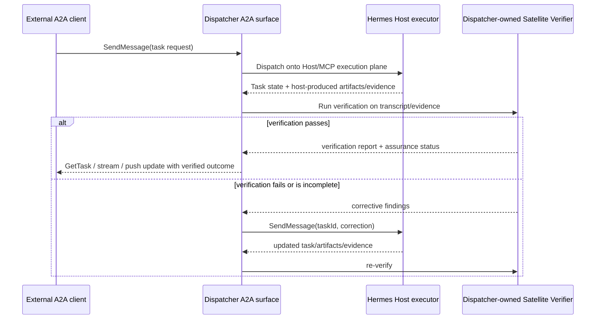

# Hermes Satellite A2A protocol surface

## Executive engineering verdict

**Stable spec facts.** A2A already gives Hermes most of the generic remote-agent surface it needs: agent discovery through Agent Cards, declared skills/capabilities/security, task submission, streaming, polling, cancellation, pagination, push notifications, versioned interfaces, and extensibility over JSON-RPC, gRPC, and HTTP+JSON/REST. Those behaviors are defined in the current A2A specification/docs and the canonical proto. [https://a2a-protocol.org/latest/specification/](https://a2a-protocol.org/latest/specification/) [https://github.com/a2aproject/A2A/blob/v1.0.1/specification/a2a.proto](https://github.com/a2aproject/A2A/blob/v1.0.1/specification/a2a.proto)

**Stable spec facts.** A2A does **not** define independent execution verification, evidence-tier scoring, transcript completeness guarantees, cost reconciliation, or acceptance-criteria enforcement. In fact, the spec says `Task.history` is partial/implementation-defined and clients disconnected from streams may miss messages, so A2A history alone is not a verifier-grade transcript. [https://a2a-protocol.org/latest/specification/](https://a2a-protocol.org/latest/specification/)

**Recommendations/inference.** Hermes should reuse A2A for the transport-level collaboration contract, but keep the verified-execution contract as a Hermes-specific extension/profile owned by the Dispatcher. Initial product direction should be a **Dispatcher-fronted A2A server** that translates A2A tasks onto the existing Host/MCP execution plane, plus a later **Dispatcher A2A client** for outbound interoperability. Do **not** make the Hermes Host the authoritative A2A surface for verified completion, because that would blur the verifier boundary that differentiates Hermes Satellite.

## Current version and source baseline

### Stable spec facts
- The repo’s latest non-prerelease release is `v1.0.1` (published 2026-05-28), while `docs/specification.md` still labels `1.0.0` as the “Latest Released Version.” [https://github.com/a2aproject/A2A/releases/tag/v1.0.1](https://github.com/a2aproject/A2A/releases/tag/v1.0.1) [https://github.com/a2aproject/A2A/blob/v1.0.1/docs/specification.md](https://github.com/a2aproject/A2A/blob/v1.0.1/docs/specification.md)
- A2A version negotiation uses `Major.Minor`; patch versions “do not affect protocol compatibility” and “SHOULD NOT” appear in requests, responses, or Agent Cards. [https://a2a-protocol.org/latest/specification/](https://a2a-protocol.org/latest/specification/)
- The normative protocol source is `specification/a2a.proto`; the published JSON Schema bundle is explicitly non-normative. [https://github.com/a2aproject/A2A/blob/v1.0.1/specification/a2a.proto](https://github.com/a2aproject/A2A/blob/v1.0.1/specification/a2a.proto) [https://github.com/a2aproject/A2A/blob/v1.0.1/specification/json/README.md](https://github.com/a2aproject/A2A/blob/v1.0.1/specification/json/README.md) [https://a2a-protocol.org/v1.0.1/spec/a2a.json](https://a2a-protocol.org/v1.0.1/spec/a2a.json)
- The governance model is a Technical Steering Committee with open meetings and contributor/maintainer roles defined in project governance. [https://github.com/a2aproject/A2A/blob/main/GOVERNANCE.md](https://github.com/a2aproject/A2A/blob/main/GOVERNANCE.md) [https://github.com/a2aproject/A2A/blob/main/MAINTAINERS.md](https://github.com/a2aproject/A2A/blob/main/MAINTAINERS.md)
- The three official core bindings are JSON-RPC, gRPC, and HTTP+JSON/REST. [https://a2a-protocol.org/latest/specification/](https://a2a-protocol.org/latest/specification/) [https://a2a-protocol.org/latest/topics/custom-protocol-bindings/](https://a2a-protocol.org/latest/topics/custom-protocol-bindings/)

### Recommendations/inference
- Engineering baseline: target **A2A protocol 1.0 semantics**, audit field/method details against the `v1.0.1` proto/release notes, and send `A2A-Version: 1.0` on wire requests.
- Treat any docs/proto mismatch as a prototype gate, not as permission to invent Hermes-only semantics.

## Question coverage

### Q1. What is the current stable A2A specification/version, governance model, and set of official protocol bindings?
**Stable spec facts.** The practical stable baseline is A2A **1.0** semantics, with repo release `v1.0.1` as the latest patch release and `Major.Minor` versioning on the wire. Governance is TSC-led. Official bindings are JSON-RPC, gRPC, and HTTP+JSON/REST. [https://github.com/a2aproject/A2A/releases/tag/v1.0.1](https://github.com/a2aproject/A2A/releases/tag/v1.0.1) [https://a2a-protocol.org/latest/specification/](https://a2a-protocol.org/latest/specification/) [https://github.com/a2aproject/A2A/blob/main/GOVERNANCE.md](https://github.com/a2aproject/A2A/blob/main/GOVERNANCE.md)

### Q2. How do Agent Cards, skills, capabilities, interfaces, authentication declarations, and discovery work?
**Stable spec facts.** An Agent Card is the discovery document. It carries `name`, `description`, ordered `supportedInterfaces`, agent `version`, `capabilities`, `securitySchemes`, `securityRequirements`, default input/output modes, and `skills`; skills can override media modes and security requirements. Public discovery is via `/.well-known/agent-card.json`; authenticated detail can be fetched via `GetExtendedAgentCard` / `/extendedAgentCard`. The current discovery guide also says curated registries and direct/private configuration are valid deployment patterns, but registry APIs are not standardized. [https://github.com/a2aproject/A2A/blob/v1.0.1/specification/a2a.proto](https://github.com/a2aproject/A2A/blob/v1.0.1/specification/a2a.proto) [https://a2a-protocol.org/latest/topics/agent-discovery/](https://a2a-protocol.org/latest/topics/agent-discovery/) [https://a2a-protocol.org/latest/specification/](https://a2a-protocol.org/latest/specification/)

### Q3. What are the exact Task, Message, Part, Artifact, Context, and status models?
**Stable spec facts.** `Task` has `id`, optional `context_id`, required `status`, repeated `artifacts`, repeated `history`, and `metadata`. `TaskStatus` has `state`, optional `message`, and `timestamp`. `TaskState` values are `SUBMITTED`, `WORKING`, `COMPLETED`, `FAILED`, `CANCELED`, `INPUT_REQUIRED`, `REJECTED`, and `AUTH_REQUIRED`. `Message` has `message_id`, optional `context_id`, optional `task_id`, `role`, repeated `parts`, `metadata`, `extensions`, and `reference_task_ids`. `Part` is a oneof over `text`, `raw`, `url`, or structured `data`, plus `metadata`, `filename`, and `media_type`. `Artifact` has `artifact_id`, `name`, `description`, repeated `parts`, `metadata`, and `extensions`. Context is just an optional grouping identifier; the spec does not define stronger transcript semantics on top of it. [https://github.com/a2aproject/A2A/blob/v1.0.1/specification/a2a.proto](https://github.com/a2aproject/A2A/blob/v1.0.1/specification/a2a.proto) [https://a2a-protocol.org/latest/specification/](https://a2a-protocol.org/latest/specification/)

### Q4. How should Hermes operations map to A2A primitives: submit, status, result, respond/continue, cancel, list, transcript/history, and notifications?
**Stable spec facts.** The core A2A operations are `SendMessage`, `SendStreamingMessage`, `GetTask`, `ListTasks`, `CancelTask`, `SubscribeToTask`, push-notification config operations, and `GetExtendedAgentCard`. [https://a2a-protocol.org/latest/specification/](https://a2a-protocol.org/latest/specification/) [https://github.com/a2aproject/A2A/blob/v1.0.1/specification/a2a.proto](https://github.com/a2aproject/A2A/blob/v1.0.1/specification/a2a.proto)

**Recommendations/inference.** Hermes can map submit/status/respond/cancel/list/notifications directly, but verifier-grade transcript retrieval remains a Hermes-specific extension because A2A history is not complete enough.

### Q5. What do streaming, task subscription, push notifications, resumption, reconnect, and long-running/offline task semantics actually guarantee?
**Stable spec facts.** `SendStreamingMessage` returns either a one-message stream or a task lifecycle stream; `SubscribeToTask` must start with the current `Task` state; multiple active streams for the same task must receive the same events in the same order; push notifications are webhook POSTs carrying the same `StreamResponse` envelope; clients should process notifications idempotently because duplicates may occur; agents must attempt delivery at least once and may retry. [https://a2a-protocol.org/latest/specification/](https://a2a-protocol.org/latest/specification/) [https://a2a-protocol.org/latest/topics/streaming-and-async/](https://a2a-protocol.org/latest/topics/streaming-and-async/)

**Unresolved.** The topic guide says streams close on terminal **or interrupted** states, but the normative operation text says streams must close on **terminal** states. Prototype against SDKs before depending on stream behavior around `INPUT_REQUIRED` or `AUTH_REQUIRED`. [https://a2a-protocol.org/latest/topics/streaming-and-async/](https://a2a-protocol.org/latest/topics/streaming-and-async/) [https://a2a-protocol.org/latest/specification/](https://a2a-protocol.org/latest/specification/)

### Q6. What does A2A specify for authentication, authorization declarations, version negotiation, compatibility, and extensions?
**Stable spec facts.** Agent Cards declare `securitySchemes` and `securityRequirements`; supported scheme types are API key, HTTP auth, OAuth 2.0, OpenID Connect, and mTLS. Production HTTP bindings must use HTTPS/TLS. Authorization policy is explicitly implementation-specific, but servers must scope task access to the authenticated caller and avoid leaking unauthorized resource existence. Clients must send `A2A-Version`; agents must process according to that `Major.Minor` or return `VersionNotSupportedError`. Extensions are URI-identified, declared in capabilities, and activated per request; breaking extension changes require a new URI. [https://github.com/a2aproject/A2A/blob/v1.0.1/specification/a2a.proto](https://github.com/a2aproject/A2A/blob/v1.0.1/specification/a2a.proto) [https://a2a-protocol.org/latest/specification/](https://a2a-protocol.org/latest/specification/) [https://a2a-protocol.org/latest/topics/extensions/](https://a2a-protocol.org/latest/topics/extensions/)

### Q7. Should Hermes Satellite initially expose an A2A server, consume A2A as a client, or eventually do both?
**Stable spec facts.** A2A is the agent-to-agent layer and MCP remains the agent-to-tool/resource layer; the official docs present them as complementary rather than replacement protocols. [https://a2a-protocol.org/latest/topics/a2a-and-mcp/](https://a2a-protocol.org/latest/topics/a2a-and-mcp/)

**Recommendations/inference.** Initial posture: **A2A server first**, but front it from the Dispatcher/control plane rather than the Hermes Host. Later posture: **both**, once the Task Engine exposes a protocol-neutral adapter and the Dispatcher can also call third-party A2A servers safely.

### Q8. Which Hermes concepts remain domain extensions: acceptance criteria, `AtomicClaim`, evidence tiers, oracle results, verification reports, confidence ceilings, corrective loops, transcripts as evidence, and cost reconciliation?
**Recommendations/inference.** All of them remain **Hermes-specific extensions** or profile rules. A2A does not define acceptance criteria, `AtomicClaim`, evidence tiers, oracle results, verification reports, confidence ceilings, corrective loops, transcripts as evidence, or cost reconciliation. These should ride as Hermes metadata/artifacts/extensions above core A2A tasks, not as assumed A2A-native semantics. [https://a2a-protocol.org/latest/specification/](https://a2a-protocol.org/latest/specification/) [https://a2a-protocol.org/latest/topics/extensions/](https://a2a-protocol.org/latest/topics/extensions/)

### Q9. How should Dispatcher-owned verification and Hermes-Host-produced evidence be represented without implying that the verifier lives under the host?
**Recommendations/inference.** Keep host execution evidence as task outputs or host-side evidence artifacts, but make verification outputs separate Dispatcher-owned artifacts/status messages under a Hermes extension/profile. The Dispatcher owns the Satellite Verifier. Hermes Host owns task execution. Even when co-located, their roles and execution contexts remain separate.

### Q10. What official SDK, conformance, schema, or interoperability test assets can reduce implementation risk?
**Stable spec facts.** Official SDK repos are listed for Python, Go, Java, JavaScript, .NET, and Rust; the project also publishes an official samples repo and tutorials. The normative proto and published JSON Schema bundle are the best machine-readable compatibility assets in current sources. [https://a2a-protocol.org/latest/sdk/](https://a2a-protocol.org/latest/sdk/) [https://github.com/a2aproject/a2a-python](https://github.com/a2aproject/a2a-python) [https://github.com/a2aproject/a2a-go](https://github.com/a2aproject/a2a-go) [https://github.com/a2aproject/a2a-java](https://github.com/a2aproject/a2a-java) [https://github.com/a2aproject/a2a-js](https://github.com/a2aproject/a2a-js) [https://github.com/a2aproject/a2a-dotnet](https://github.com/a2aproject/a2a-dotnet) [https://github.com/a2aproject/a2a-rs](https://github.com/a2aproject/a2a-rs) [https://github.com/a2aproject/a2a-samples](https://github.com/a2aproject/a2a-samples) [https://github.com/a2aproject/A2A/blob/v1.0.1/specification/a2a.proto](https://github.com/a2aproject/A2A/blob/v1.0.1/specification/a2a.proto) [https://a2a-protocol.org/v1.0.1/spec/a2a.json](https://a2a-protocol.org/v1.0.1/spec/a2a.json)

**Missing evidence.** No dedicated official conformance-suite repo or interoperability certification program was found in the primary sources inspected.

### Q11. What ambiguities need a prototype or an explicit architecture decision?
**Unresolved.** At minimum: stream closure behavior around interrupted states; whether Hermes correction loops stay in one A2A task or fork follow-on tasks; how verifier artifacts are exposed without overstating host authority; how transcript evidence is retrieved when `Task.history` is partial; and how task visibility/tenant identity should align with future Task Engine seams. These Task Engine seams remain unresolved and should not be silently decided yet.

## Hermes-to-A2A mapping matrix

All A2A operation names and baseline semantics below come from the spec/proto. [https://a2a-protocol.org/latest/specification/](https://a2a-protocol.org/latest/specification/) [https://github.com/a2aproject/A2A/blob/v1.0.1/specification/a2a.proto](https://github.com/a2aproject/A2A/blob/v1.0.1/specification/a2a.proto)

| Hermes surface | Closest A2A primitive | Reuse now? | Notes |
|---|---|---:|---|
| submit | `SendMessage` or `SendStreamingMessage` | Yes | Use `Message` + `SendMessageConfiguration`; `returnImmediately=true` matches async Hermes dispatch best. |
| status | `GetTask` | Yes | Poll current `Task.status`, optionally with bounded `historyLength`. |
| result | `GetTask` final `Task` / direct `Message` | Partial | Final task state and artifacts map cleanly; verifier-grade completion does not. |
| respond/continue | `SendMessage` against existing `taskId`/`contextId` | Yes | Best fit for corrective follow-up or additional input on non-terminal tasks. |
| cancel | `CancelTask` | Yes | Native semantic fit. |
| list | `ListTasks` | Yes | Cursor pagination and caller-scoped visibility are already specified. |
| transcript/history | `Task.history` | No | `Task.history` is partial and implementation-defined; not enough for transcript evidence. Keep as Hermes-specific extension or side-channel artifact. |
| notifications | `SubscribeToTask` + push notification config operations | Yes | Reuse native SSE/webhook semantics for wakeups and long-running/offline cases. |

## Reusable protocol primitives vs Hermes-specific extensions

### Reusable protocol primitives
- Agent discovery via `/.well-known/agent-card.json`, private configuration, or registries. [https://a2a-protocol.org/latest/topics/agent-discovery/](https://a2a-protocol.org/latest/topics/agent-discovery/)
- Ordered `supportedInterfaces` with protocol binding + protocol version per interface. [https://github.com/a2aproject/A2A/blob/v1.0.1/specification/a2a.proto](https://github.com/a2aproject/A2A/blob/v1.0.1/specification/a2a.proto)
- Core task lifecycle and status model. [https://github.com/a2aproject/A2A/blob/v1.0.1/specification/a2a.proto](https://github.com/a2aproject/A2A/blob/v1.0.1/specification/a2a.proto)
- Multi-turn continuation with `SendMessage` on non-terminal tasks. [https://a2a-protocol.org/latest/specification/](https://a2a-protocol.org/latest/specification/)
- Streaming updates, resubscription, and push notification wakeups. [https://a2a-protocol.org/latest/specification/](https://a2a-protocol.org/latest/specification/) [https://a2a-protocol.org/latest/topics/streaming-and-async/](https://a2a-protocol.org/latest/topics/streaming-and-async/)
- Standard auth declarations and per-caller authorization scoping. [https://a2a-protocol.org/latest/specification/](https://a2a-protocol.org/latest/specification/)
- Extension activation by URI. [https://a2a-protocol.org/latest/topics/extensions/](https://a2a-protocol.org/latest/topics/extensions/)

### Hermes-specific extensions
- acceptance criteria
- `AtomicClaim`
- evidence tiers
- oracle results
- verification reports
- confidence ceilings
- corrective loops as assurance policy rather than mere multi-turn chat
- transcripts as evidence
- cost reconciliation
- verifier-owned status labels such as “verified”, “unverifiable”, or assurance ceilings above plain task completion

**Recommendation/inference.** Put these Hermes-specific extension semantics into one explicit Hermes profile/extension family, rather than leaking them into unsourced assumptions about base A2A.

## Role and sequence diagram

Dispatcher owns the Satellite Verifier. Hermes Host owns task execution. Their roles and execution contexts remain separate.

**Representation rule.** The Host may produce execution artifacts and host-side evidence, but the verification report should be a Dispatcher-owned artifact or extension payload so clients never infer that the verifier lives under the Host.

## Local, BYO Cloudflare, and managed-relay implications

### Stable spec facts
- Public discovery can use the well-known Agent Card path; private deployments may use direct configuration instead; registries are valid but not standardized. [https://a2a-protocol.org/latest/topics/agent-discovery/](https://a2a-protocol.org/latest/topics/agent-discovery/)
- Production HTTP-based deployments must use HTTPS/TLS, and auth requirements are declared in the Agent Card. [https://a2a-protocol.org/latest/specification/](https://a2a-protocol.org/latest/specification/)
- A2A push notifications are outbound HTTPS webhook POSTs carrying `StreamResponse`. [https://a2a-protocol.org/latest/specification/](https://a2a-protocol.org/latest/specification/)

### Recommendations/inference
- **local**: direct/private discovery is enough; same-machine deployment is fine, but keep Dispatcher and Host as separate roles/processes.
- **BYO Cloudflare**: treat Cloudflare as transport edge only. Polling fits easily through HTTPS. Push callbacks need a reachable webhook and explicit auth story; if webhook reachability is awkward, polling remains spec-compliant fallback.
- **managed relay**: relay value is identity, pairing, wake routing, audit, and multi-tenant control-plane policy, not new task semantics. Keep the A2A contract stable and layer relay policy above it.

## Recommendation: A2A server, A2A client, or both

### Stable spec facts
- The official A2A/MCP comparison says A2A is for agent-to-agent collaboration and MCP is for agent-to-tool/resource use; they are complementary. [https://a2a-protocol.org/latest/topics/a2a-and-mcp/](https://a2a-protocol.org/latest/topics/a2a-and-mcp/)
- Agents may expose multiple interfaces and clients may choose among them. [https://a2a-protocol.org/latest/specification/](https://a2a-protocol.org/latest/specification/) [https://github.com/a2aproject/A2A/blob/v1.0.1/specification/a2a.proto](https://github.com/a2aproject/A2A/blob/v1.0.1/specification/a2a.proto)

### Recommendations/inference
1. **Initial:** expose a **Dispatcher-fronted A2A server**.
2. **Not initial:** do **not** start with a Host-fronted “done means completed” surface.
3. **Later:** support **both** server and client roles once the Task Engine adapter is settled.
4. **Why:** Hermes already behaves like a remote service to outside callers, while outbound A2A client behavior is additive and should not block the verified-execution surface.

## Official implementation and conformance assets

- Normative proto: `specification/a2a.proto`. [https://github.com/a2aproject/A2A/blob/v1.0.1/specification/a2a.proto](https://github.com/a2aproject/A2A/blob/v1.0.1/specification/a2a.proto)
- Published JSON Schema bundle for tooling validation (non-normative). [https://a2a-protocol.org/v1.0.1/spec/a2a.json](https://a2a-protocol.org/v1.0.1/spec/a2a.json) [https://github.com/a2aproject/A2A/blob/v1.0.1/specification/json/README.md](https://github.com/a2aproject/A2A/blob/v1.0.1/specification/json/README.md)
- Official SDK index. [https://a2a-protocol.org/latest/sdk/](https://a2a-protocol.org/latest/sdk/)
- Official SDK repos: [https://github.com/a2aproject/a2a-python](https://github.com/a2aproject/a2a-python) [https://github.com/a2aproject/a2a-go](https://github.com/a2aproject/a2a-go) [https://github.com/a2aproject/a2a-java](https://github.com/a2aproject/a2a-java) [https://github.com/a2aproject/a2a-js](https://github.com/a2aproject/a2a-js) [https://github.com/a2aproject/a2a-dotnet](https://github.com/a2aproject/a2a-dotnet) [https://github.com/a2aproject/a2a-rs](https://github.com/a2aproject/a2a-rs)
- Official samples repo and tutorials for interop examples. [https://github.com/a2aproject/a2a-samples](https://github.com/a2aproject/a2a-samples) [https://a2a-protocol.org/latest/sdk/](https://a2a-protocol.org/latest/sdk/)
- Release notes/changelog for migration deltas. [https://github.com/a2aproject/A2A/releases/tag/v1.0.1](https://github.com/a2aproject/A2A/releases/tag/v1.0.1) [https://github.com/a2aproject/A2A/blob/v1.0.1/CHANGELOG.md](https://github.com/a2aproject/A2A/blob/v1.0.1/CHANGELOG.md)
- **Missing evidence:** no official standalone conformance suite or certification program was located in current primary sources.

## Unresolved decisions and prototype questions

1. **Interrupted-state streaming ambiguity:** confirm whether `INPUT_REQUIRED` / `AUTH_REQUIRED` close streams in real SDKs.
2. **Verifier artifact shape:** decide whether assurance output is a separate Artifact, a status `Message`, or a Hermes extension payload.
3. **Transcript evidence path:** `Task.history` is insufficient; choose extension vs side-channel artifact without pretending base A2A solved it.
4. **Task identity across corrective loops:** decide whether `hermes_respond` stays inside one A2A task or spawns linked tasks.
5. **Task Engine adapter boundary:** keep the Task Engine protocol-neutral; do not decide yet on binding-specific shapes that leak A2A into the core.
6. **Managed relay wake strategy:** decide when polling is enough and when webhook relaying is mandatory.
7. **Security/tenant model:** align A2A `tenant` + caller-scoped visibility with Hermes principal mapping, but leave unresolved Task Engine seams explicitly unresolved for now.

## Wayfinder issue implications

- **Wayfinder #27 — Task Engine contract:** keep the engine aligned to abstract A2A operations (`send`, `get`, `list`, `cancel`, `subscribe`, notifications), but keep transcript evidence and assurance artifacts outside the neutral core until the seam is designed. [https://github.com/AojdevStudio/hermes-satellite/issues/27](https://github.com/AojdevStudio/hermes-satellite/issues/27)
- **Wayfinder #28 — Local Mode topology:** local mode may co-locate roles on one machine, but the Dispatcher/verifier and Host/executor still need separate execution contexts and ownership boundaries. [https://github.com/AojdevStudio/hermes-satellite/issues/28](https://github.com/AojdevStudio/hermes-satellite/issues/28)
- **Wayfinder #30 — Managed Relay control plane:** relay should handle discovery, identity routing, and wake delivery; it should not redefine task semantics already covered by A2A. [https://github.com/AojdevStudio/hermes-satellite/issues/30](https://github.com/AojdevStudio/hermes-satellite/issues/30)
- **Wayfinder #32 — identity and authorization:** reuse Agent Card security declarations and caller-scoped task visibility, but keep pairing, principal mapping, and transcript-access policy as Hermes domain policy. [https://github.com/AojdevStudio/hermes-satellite/issues/32](https://github.com/AojdevStudio/hermes-satellite/issues/32)
- **Wayfinder #36 — assurance ceiling:** A2A transport security improves communication trust, but Hermes assurance still depends on independent verification, transcript evidence quality, and explicit confidence ceilings. [https://github.com/AojdevStudio/hermes-satellite/issues/36](https://github.com/AojdevStudio/hermes-satellite/issues/36)

## Source ledger

| Source | Scope used here | Version/tag/date |
|---|---|---|
| [A2A spec overview](https://a2a-protocol.org/latest/specification/) | operations, versioning, auth, bindings, history limits, push semantics | latest docs, accessed 2026-07-11 |
| [A2A proto](https://github.com/a2aproject/A2A/blob/v1.0.1/specification/a2a.proto) | normative data model and RPC names | tag `v1.0.1` |
| [A2A v1.0.1 release](https://github.com/a2aproject/A2A/releases/tag/v1.0.1) | latest patch release baseline | published 2026-05-28 |
| [A2A changelog](https://github.com/a2aproject/A2A/blob/v1.0.1/CHANGELOG.md) | patch-level migration notes | tag `v1.0.1` |
| [Agent discovery guide](https://a2a-protocol.org/latest/topics/agent-discovery/) | well-known path, private discovery, registries | latest docs |
| [Streaming and async guide](https://a2a-protocol.org/latest/topics/streaming-and-async/) | SSE/push usage and reconnect guidance | latest docs |
| [Extensions guide](https://a2a-protocol.org/latest/topics/extensions/) | extension declaration/activation/versioning | latest docs |
| [Custom bindings guide](https://a2a-protocol.org/latest/topics/custom-protocol-bindings/) | official bindings vs custom bindings | latest docs |
| [Extension and binding governance](https://a2a-protocol.org/latest/topics/extension-and-binding-governance/) | governance for extensions/bindings | latest docs |
| [A2A and MCP](https://a2a-protocol.org/latest/topics/a2a-and-mcp/) | complementary positioning vs MCP | latest docs |
| [A2A governance charter](https://github.com/a2aproject/A2A/blob/main/GOVERNANCE.md) | TSC governance model | current main |
| [A2A SDK index](https://a2a-protocol.org/latest/sdk/) | official SDK repo list | latest docs |
| [Published JSON Schema bundle](https://a2a-protocol.org/v1.0.1/spec/a2a.json) | machine-readable tooling artifact | `v1.0.1` |

## Confidence and missing-evidence notes

- **High confidence:** task model, operation names, versioning rules, Agent Card structure, auth declarations, and official bindings.
- **Medium confidence:** recommended Dispatcher-fronted server shape; it follows the preserved Hermes architecture facts plus A2A’s abstract model, but it is still an architectural recommendation rather than an explicit A2A requirement.
- **Medium-low confidence:** precise stream behavior around interrupted states because current official topic and spec text are not perfectly aligned.
- **Missing evidence:** no official conformance suite; no official verified-execution profile; no A2A-native transcript completeness guarantee; no primary-source basis for treating `Task.history` as evidentiary transcript.
