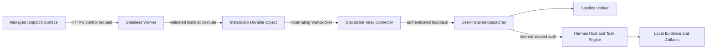

# Managed Relay control-plane architecture

Status: decision-ready research

Date: 2026-07-12

Wayfinder ticket: [Design the Managed Relay control plane](https://github.com/AojdevStudio/hermes-satellite/issues/30)

## Executive verdict

Managed v1 should use one stateless **Cloudflare Worker** in front of one **SQLite-backed Durable Object per Hermes Satellite installation**. The User-installed **Dispatcher**, or a tightly coupled connector acting only for it, opens an outbound WebSocket to its installation object. The Hermes Host service and Host listener never connect to or become reachable through the relay.

The Durable Object uses the WebSocket Hibernation API, stores a bounded pending control-envelope outbox, and uses its single alarm for expiry and retry scheduling. It does not run Task Engine logic. A relay receipt is only `relay_queued`; a Task is accepted only after the local Dispatcher durably commits the canonical command and returns the Task ID and Task Event cursor.

Do not add Cloudflare Queues, D1, KV, R2, Workflows, Tunnel, or a second regional relay in v1. Durable Object storage, alarms, and hibernating WebSockets cover the required routing and bounded offline-delivery atom. Full transcripts, repositories, terminal streams, verifier scratch, and bulk Artifact/Evidence bodies never enter this data path.

## Why Worker plus one Durable Object per installation

Cloudflare recommends a stateless Worker for authentication, validation, and routing, with a Durable Object as the stateful coordination atom. Durable Objects are globally named, strongly consistent, and carry private storage; they are reached through a Worker rather than directly from the Internet. One installation is the natural coordination atom because its outbound connection, pending envelopes, acknowledgements, and backpressure must be serialized independently of every other installation. [Durable Objects overview](https://developers.cloudflare.com/durable-objects/) [Rules of Durable Objects](https://developers.cloudflare.com/durable-objects/best-practices/rules-of-durable-objects/) [Getting started](https://developers.cloudflare.com/durable-objects/get-started/)



The Worker consumes an abstract authenticated principal and authorization decision from the later identity contract. It validates the outer route, method, schema version, expiry, and size, then derives the Durable Object from an opaque installation routing identifier. It does not decide Task ownership or translate MCP/A2A task semantics.

The installation Durable Object owns only:

- one current Dispatcher connection and its durable connection epoch;
- pending control envelopes and their delivery state;
- envelope-level idempotency, expiry, attempt, and acknowledgement metadata;
- lightweight connection/presence and delivery audit metadata;
- backpressure for that installation.

The local Dispatcher and Task Engine remain authoritative for Tasks, Executions, Events, verification, Evidence, and results.

## Outbound connection and hibernation

The Dispatcher-side connector initiates `wss://` to the Worker, which routes the upgrade to the installation Durable Object. The Durable Object accepts the server side with `acceptWebSocket()`. This orientation matters: Cloudflare hibernation works when the Durable Object is the WebSocket server, allowing the object to leave memory while the connection stays attached and avoiding duration charges while idle. Connection metadata needed after hibernation belongs in the WebSocket attachment or Durable Object storage because in-memory state is discarded. [WebSocket hibernation](https://developers.cloudflare.com/durable-objects/best-practices/websockets/) [Durable Object state API](https://developers.cloudflare.com/durable-objects/api/state/) [Lifecycle](https://developers.cloudflare.com/durable-objects/concepts/durable-object-lifecycle/)

Runtime deployments, Cloudflare maintenance, network changes, process restarts, and machine sleep can still terminate a socket. The connector therefore reconnects with bounded exponential backoff and jitter. A valid replacement connection atomically increments a durable installation connection epoch before it is accepted. The epoch is stored in the WebSocket attachment; every delivery and acknowledgement carries it. The Durable Object rejects frames from older epochs, then closes the displaced socket. Reconnection resumes from Durable Object pending-envelope state and local Task Event cursors; it never treats a socket as durable truth. The later identity contract decides which credential may advance the epoch.

The Durable Object is first instantiated by the installation connection so Cloudflare normally places it near the Hermes machine. Durable Objects do not currently relocate after creation, and location hints are best-effort. Managed v1 accepts that single-region coordination point. Jurisdiction selection and future installation migration must follow the later managed identity/data policy rather than being invented here. [Durable Object data location](https://developers.cloudflare.com/durable-objects/reference/data-location/)

## Control envelope and data boundary

Every relay frame has a small outer envelope:

```text
schemaVersion, envelopeId, installationRoute, direction, kind,
requestId, protocol, idempotencyKey, createdAt, expiresAt,
contentType, traceId, payload
```

The allowed payload set is deliberately narrow:

- Task create/continue/cancel commands and online-only queries;
- bounded prompt and Message content;
- Task snapshots, Task Event cursor notices, and small final responses;
- Verification Reports, Artifact/Evidence descriptors, and explicitly authorized small Evidence excerpts;
- relay acknowledgement, error, presence, and wake metadata.

Managed v1 uses one canonical wire representation: versioned UTF-8 JSON produced by a shared encoder. Opaque ciphertext, when later enabled, is a base64url value inside that JSON. Worker ingress and Durable Object storage inspect or retain the same immutable encoded envelope byte array and compute its length directly; byte count is delivery metadata, not a caller-controlled envelope field. Compression and relay-level fragmentation are not supported.

That immutable envelope byte array has a **256 KiB ceiling**. At WebSocket delivery, the Durable Object places it inside a transport wrapper carrying the current connection epoch; wrapper metadata is separately limited to 1 KiB. Acknowledgements carry the same epoch in their wrapper, and stale epochs are rejected. Larger envelopes or wrappers are rejected rather than fragmented. Cloudflare permits much larger WebSocket messages, so these lower limits are Hermes Satellite privacy, cost, and backpressure boundaries rather than provider limits. [Durable Object limits](https://developers.cloudflare.com/durable-objects/platform/limits/)

The relay has no API for repository files, full transcripts, terminal byte streams, verifier scratch, or bulk Artifact/Evidence bodies. Do not add R2 as an escape hatch. Whether pending payload bytes are AOJ-readable, end-to-end encrypted, and how long delivery metadata remains are explicitly deferred to the managed identity/data ticket; the relay format must work with opaque ciphertext plus visible routing metadata.

Logs contain IDs, byte counts, state transitions, latency, attempts, and error classes only. They never contain payloads, credentials, prompts, results, or Evidence excerpts.

## Two-stage acknowledgement and bounded offline delivery

Relay durability must not counterfeit Task durability:

The offline mailbox is available only to the first-party Managed API in v1, whose UI understands relay states. Transparent MCP and A2A forwarding is online-only: if the installation is disconnected, those callers receive an unavailable response rather than a Hermes-specific relay receipt.

For an offline-capable first-party mutation:

1. The Worker and Durable Object validate the envelope and authorization context.
2. The Durable Object atomically stores a unique pending envelope before returning `relay_queued` with `envelopeId`. This means only that AOJ has custody of the bounded envelope.
3. If the Dispatcher connection is available, the Durable Object sends it immediately; otherwise it remains pending until reconnection or expiry.
4. The Dispatcher submits the command to its local Task Engine with the original idempotency key.
5. Only after the Task Engine commits the canonical mutation and Task Event does the Dispatcher return `dispatcher_committed` with the canonical command response, Task ID, and cursor.
6. The Durable Object marks the envelope delivered, removes its payload bytes, and makes the canonical acknowledgement available to the Dispatch Surface.

If acknowledgement is lost after local commit, redelivery uses the same principal, operation, and idempotency key. The Task Engine returns the original result instead of creating another Task. The relay therefore offers at-least-once delivery, not exactly-once execution.

Queries are never stored for offline delivery and never synthesize a Task Event. While the installation is online, the relay correlates a query request to the Dispatcher's canonical response and returns it as `query_response`; while offline, it returns unavailable. Protocol-adapter requests likewise return only valid MCP/A2A responses or transport errors.

Pending envelopes are bounded by a configured maximum count, aggregate bytes, and expiry. The identity/data contract sets the exact retention values before launch; all three bounds are mandatory and finite. At capacity, the Durable Object rejects new work with a retryable backpressure response instead of evicting older accepted envelopes. Expired envelopes become terminal relay failures and never become failed Tasks because no Task was accepted.

SQLite storage supplies atomic persistence. One Durable Object alarm tracks the earliest retry or expiry, processes due rows, and reschedules itself. Alarms are at-least-once and support multiple scheduled items through stored state plus the next alarm, so handlers must be idempotent. [SQLite storage](https://developers.cloudflare.com/durable-objects/api/sqlite-storage-api/) [Alarms](https://developers.cloudflare.com/durable-objects/api/alarms/)

## Backpressure and recovery

Backpressure exists at three boundaries:

| Boundary | Managed v1 behavior |
|---|---|
| Worker ingress | Reject invalid/oversized envelopes before Durable Object routing |
| Installation outbox | Enforce finite pending count and bytes; return retryable capacity error without storing |
| Dispatcher socket | Drain a bounded in-flight window; require the current connection epoch and per-envelope acknowledgement before advancing |

State-change notifications are wake hints carrying `taskId` and cursor, not a second event log. A dropped hint is recovered by `getTask`/`listEvents(afterCursor)`. Delivery disconnect never cancels a Task.

Failure behavior is deterministic:

- **installation offline:** the first-party Managed API queues mutations only within the configured bounds and expiry and shows `relay_queued`, never `Task accepted`; MCP/A2A and all queries report unavailable;
- **relay/DO restart:** reconstruct from SQLite and WebSocket attachments; both sides reconnect;
- **commit succeeded, acknowledgement lost:** redeliver on the current connection epoch with the same idempotency key and recover the original Task ID/cursor;
- **socket replaced:** increment the durable epoch, reject all older-epoch frames, and redeliver unacknowledged work on the current connection;
- **Dispatch Surface disconnected:** Task continues locally; surface later polls envelope status and Task Events;
- **queue full or expired:** return explicit relay capacity/expiry state; do not invent a Task Outcome;
- **AOJ outage:** local execution and verification continue for already accepted Tasks; Managed reachability reports unavailable.

## MCP and A2A boundary

The relay transports protocol calls to the Dispatcher adapter; it does not implement either lifecycle.

- **A2A:** while the installation is online, Managed v1 supports non-streaming Send/Get/List/Cancel through the existing Dispatcher-fronted A2A server. Offline A2A requests return unavailable; they never receive `relay_queued`. A2A already allows asynchronous Tasks to be retrieved through polling, streaming, or push. Do not advertise streaming or push notifications until relay reconnect/cursor conformance and webhook security/retry exist. [A2A 1.0 specification](https://github.com/a2aproject/A2A/blob/main/docs/specification.md)
- **MCP:** while the installation is online, Managed v1 supports Streamable HTTP POST request/JSON response forwarding. Offline MCP requests return a transport error; they never receive `relay_queued`. MCP permits a server to return JSON and to answer GET with `405` when it does not offer SSE. Do not hold an SSE response open through the Durable Object in v1; clients poll the canonical Task tools. [MCP 2025-11-25 Streamable HTTP](https://modelcontextprotocol.io/specification/2025-11-25/basic/transports)
- **First-party web:** it may poll envelope/Task status and consume lightweight wake hints, but its UI state is not Task state.
- **Callbacks:** no arbitrary webhook or A2A push callback relay in v1. Adding it would require a new outbound credential, SSRF boundary, retry store, and retention policy already avoided by polling and cursor recovery.

This keeps the relay an installation router while preserving one protocol-neutral Task Engine.

## Why the other Cloudflare products are excluded

| Product | Decision |
|---|---|
| Queues | Exclude. Per-installation Durable Object storage plus alarm is already the ordered bounded queue and avoids another acknowledgement model. |
| D1 | Exclude from relay delivery. There is no cross-installation relational query on the hot path; identity may choose its own store later. |
| KV | Exclude. Routing is deterministic and pending state requires strong consistency. |
| R2 | Exclude. The relay is not a bulk Artifact/Evidence plane. |
| Workflows | Exclude. Delivery retry/expiry is one-object state plus one alarm, not a multi-step workflow. |
| Tunnel | Exclude. The Dispatcher-side connector opens the outbound WebSocket directly; Users need no Cloudflare account. |
| Multi-region relay replicas | Exclude. A single globally addressed Durable Object is the coordination authority; local Task/Event persistence is the recovery authority. |

Add one only after a measured requirement cannot be met by the Worker and installation Durable Object.

## Cost implications

The architecture starts with Cloudflare's Workers Paid minimum of **$5/month**. Current included usage is 10 million Worker requests and 30 million CPU milliseconds; SQLite-backed Durable Objects include 1 million requests, 400,000 GB-seconds, 25 billion rows read, 50 million rows written, and 5 GB-month of storage before overage. Cloudflare charges no standard Workers egress fee. Pricing can change and must be refreshed before a commercial decision. [Workers pricing](https://developers.cloudflare.com/workers/platform/pricing/)

The important cost controls are architectural:

- hibernating server-side WebSockets avoid idle Durable Object duration charges;
- bounded envelopes and immediate payload deletion prevent storage growth;
- cursor wake hints prevent storing or replaying every Task Event in AOJ infrastructure;
- no persistent SSE keeps the object from remaining billably active for idle viewers;
- no R2, Queue, D1, Workflow, or third-party log pipeline creates another usage meter;
- body-free structured logs prevent sensitive-data leakage and log-volume surprises.

The first managed prototype should measure Worker requests, incoming WebSocket messages, active Durable Object GB-seconds, rows written/read, pending bytes, delivery latency, reconnects, expiry, and backpressure per active installation. Those measurements—not guessed user counts—drive later unit economics.

## Acceptance gates

Managed Relay implementation is conformant only when tests prove:

1. The only installation-initiated cloud connection belongs to the Dispatcher side; neither Host listener nor Hermes is reachable through the relay.
2. A relay receipt cannot be presented as Task acceptance; canonical acceptance always includes the local Task ID and committed cursor.
3. Disconnect after local commit but before acknowledgement recovers one Task through the original idempotency key.
4. Offline queue count, aggregate canonical-wire bytes, and expiry are finite, atomic, observable, and fail closed under pressure.
5. The first-party Managed API distinguishes `relay_queued` from `dispatcher_committed`; offline MCP/A2A and query requests return unavailable without creating envelopes.
6. Durable Object eviction/restart and Worker deployment lose no stored pending envelope and create no duplicate Task.
7. A replacement socket advances the durable connection epoch; stale sockets cannot deliver or acknowledge work.
8. The socket hibernates when idle and reconnects after forced closure without console interaction.
9. Full transcript, repository, terminal, verifier scratch, and bulk Artifact/Evidence bodies are rejected at both ingress boundaries.
10. A dropped wake or stream is recovered from the local Task Event cursor.
11. Principal A cannot route to installation B or observe B's envelope metadata under the abstract authorization contract.
12. A2A/MCP conformance remains owned by the Dispatcher adapter; the relay advertises no unsupported streaming or push capability.
13. Queue saturation in one installation does not affect another installation's Durable Object.
14. Local work and verification continue while AOJ is unavailable, and the Managed Dispatch Surface reports the real boundary failure.

## Explicitly deferred

- AOJ account schema, pairing ceremony, principal mapping, authorization rules, credential/token cardinality, rotation, revocation, and recovery;
- payload encryption, AOJ readability, audit/payload retention periods, deletion, residency/jurisdiction selection, and legal policy;
- Commercial Tier entitlements, queue quotas, prices, service objectives, support, abuse limits, and incident commitments;
- browser session/CORS UX, notifications, mobile push, arbitrary callbacks, and support for generic third-party Managed Dispatch Surfaces;
- multi-installation routing, installation relocation, multi-region replication, and disaster-recovery objectives;
- optional Tailscale Serve beside Managed Mode, which would be a complete second Private Dispatch Surface—not an admin-only fallback.
