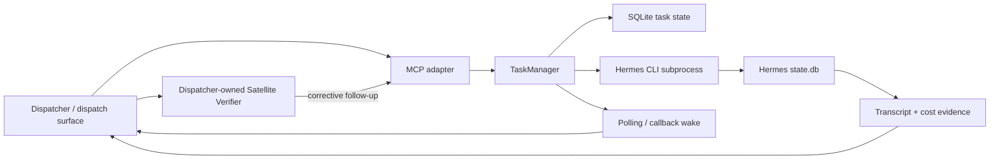

# Hermes Satellite Task Engine seams and migration constraints

Date: 2026-07-11

Scope: current repository plus read-only observation of the live Mac mini service

Purpose: establish the factual boundary for the protocol-neutral Task Engine ticket; this document does not choose an implementation

## Executive verdict

Hermes Satellite already contains the beginnings of a Task Engine, but it is not yet a durable, protocol-neutral module. The useful seam is the set of task operations behind the MCP tools: create, get, list, continue, cancel, execute, capture evidence, capture cost, and emit terminal state. Today those behaviors live together in one Python file: `create_mcp_server()` instantiates `TaskManager` directly and the MCP tools call it directly. [Bridge adapter and construction](../../apps/hermes-async-bridge/hermes_async_bridge.py#L941-L1063)

The system must preserve a second, separate seam: **Hermes Host completes execution; the Dispatcher-owned Satellite Verifier decides whether that execution is verified.** The Dispatcher workflow is submit -> poll/wake -> result -> transcript -> decompose -> read-only oracle -> report -> corrective follow-up. [Dispatcher ownership and loop](../../skills/hermes-dispatch/SKILL.md#L6-L11) [Verification steps](../../skills/hermes-dispatch/SKILL.md#L79-L134)

That yields the migration rule:

> Extract the existing task lifecycle behind adapters without moving verification authority into the Host or treating protocol-level completion as verified completion.

The current code is reusable as evidence and as a compatibility adapter, not as the final neutral contract. It has material gaps around restart recovery, cancellation, callback delivery, caller identity, follow-up lineage, and automatic verifier wiring.

## Method and evidence quality

- Code discovery started with the indexed codebase-memory graph, then exact source, docs, configuration, and live read-only host state were inspected.
- Repository facts below link to exact source lines.
- Live facts are labeled **live observation** and include the command/config source used.
- Recommendations and unresolved decisions are explicitly separated from facts.
- A2A claims reuse the completed primary-source research at commit [`56581ca`](https://github.com/AojdevStudio/hermes-satellite/blob/56581caad0d03176730f79df9e68b5ad3c9e5409/specs/research/a2a-protocol-surface.md).

## Current system map — facts



The Host-side boundary is MCP -> `TaskManager` -> Hermes subprocess/SQLite. The verification boundary is outside it, on the Dispatcher side. Co-location on one machine does not change ownership.

## 1. MCP bridge and adapter seam — facts

The bridge is a native FastMCP Streamable HTTP server. HTTP auth is configured with a static bearer verifier plus MCP `AuthSettings`; without a token, non-test HTTP construction fails. [Server/auth construction](../../apps/hermes-async-bridge/hermes_async_bridge.py#L941-L973)

The public MCP surface is a thin wrapper over `TaskManager` for submit, status, result, respond, cancel, list, and sessions. Transcript export, deterministic decomposition, cost lookup, and health are registered beside them. [MCP task tools](../../apps/hermes-async-bridge/hermes_async_bridge.py#L975-L1028) [Evidence/cost/health tools](../../apps/hermes-async-bridge/hermes_async_bridge.py#L1030-L1063)

This is already an adapter-shaped boundary, but not a module boundary:

- `TaskManager` is constructed inside `create_mcp_server()`, not injected behind an interface. [Construction](../../apps/hermes-async-bridge/hermes_async_bridge.py#L972-L973)
- The manager directly performs SQLite writes, spawns threads, invokes the Hermes CLI, captures cost, and fires callbacks. [Submit](../../apps/hermes-async-bridge/hermes_async_bridge.py#L260-L277) [Execution](../../apps/hermes-async-bridge/hermes_async_bridge.py#L469-L554)
- MCP-specific validation and serialization are mixed with the engine call sites. [Tool wrappers](../../apps/hermes-async-bridge/hermes_async_bridge.py#L975-L1054)

### Current client contract mismatches

These are current facts that the neutral contract cannot silently inherit:

1. The bridge `hermes_respond` tool expects `prompt`, while the TypeScript MCP client sends `message`. [Bridge schema](../../apps/hermes-async-bridge/hermes_async_bridge.py#L1004-L1011) [Client call](../../apps/verifier/hermes/client.ts#L116-L125)
2. The bridge supports `callback_url` on submit/respond, and Dispatcher config reads `HERMES_CALLBACK_URL`, but the TypeScript submit/respond parameter types do not contain a callback and never forward it. [Bridge callback arguments](../../apps/hermes-async-bridge/hermes_async_bridge.py#L975-L985) [Dispatcher config](../../apps/verifier/hermes/config.ts#L8-L46) [Client parameters](../../apps/verifier/hermes/client.ts#L8-L27)
3. The bridge has terminal status `cancelled`, but `TaskStatus`, `HermesResult`, and the TypeScript polling loop only model completed/failed as terminal. [Bridge terminal states](../../apps/hermes-async-bridge/hermes_async_bridge.py#L65-L65) [Client types](../../apps/verifier/hermes/types.ts#L14-L16) [Poll terminal test](../../apps/verifier/hermes/poll.ts#L53-L80)
4. `list_tasks` is global and optionally status-filtered; it has no principal/caller visibility filter. [List query](../../apps/hermes-async-bridge/hermes_async_bridge.py#L391-L424) The roadmap separately records that token-derived principal mapping is incomplete. [Known identity gap](../../ROADMAP.md#L40-L47)

## 2. SQLite task lifecycle — facts

### Persisted model

The bridge uses SQLite WAL and creates four tables:

| Table | Current responsibility |
|---|---|
| `tasks` | task identity, parent/session/profile, status, prompt/result/error, caller/callback, timestamps, PID, follow-up JSON |
| `mcp_events` | timestamped task/caller/event/payload audit rows |
| `task_runs` | per-execution command, session, loop index, PID, exit, timing, output sizes, error |
| `task_costs` | per-task/session/loop cost snapshot with provider, tokens, billing, reconciliation, and JSON snapshot |

The exact schema and indexes are in the bridge source. [SQLite schema](../../apps/hermes-async-bridge/hermes_async_bridge.py#L67-L143) Every `get_db()` call creates/reconciles the schema; reconciliation only adds missing columns to older databases. [Schema reconciliation and open](../../apps/hermes-async-bridge/hermes_async_bridge.py#L154-L221)

There are two distinct persistence authorities. `async_bridge.db` is the bridge's task/control/audit store; Hermes `state.db` remains the canonical session/message/token source used for transcript and cost evidence. Their paths are configured independently. [Database settings](../../apps/hermes-async-bridge/hermes_async_bridge.py#L46-L52) [Hermes session reads](../../apps/hermes-async-bridge/hermes_async_bridge.py#L668-L721) [Transcript fallback](../../apps/hermes-async-bridge/hermes_async_bridge.py#L831-L865)

### State transitions

| Trigger | Persisted transition | Execution behavior |
|---|---|---|
| submit | new row `pending` | daemon thread starts immediately |
| worker acquires semaphore | `pending` -> `running` | writes `task_runs`, spawns `hermes chat` |
| exit 0 | `running` -> `completed` | stores parsed result/session, captures cost, emits event/callback |
| nonzero exit | -> `failed` | stores partial output/error/session when available, captures cost, emits callback |
| hard timeout | -> `failed` | kills process, stores timeout, emits callback; no cost capture in this branch |
| unexpected exception | -> `failed` | stores error and emits callback; no cost capture in this branch |
| cancel | non-terminal -> `cancelled` | sends SIGTERM if PID exists, updates task, logs event |

Submit and follow-up creation are implemented at [task creation](../../apps/hermes-async-bridge/hermes_async_bridge.py#L260-L314); status/result/list are read at [task reads](../../apps/hermes-async-bridge/hermes_async_bridge.py#L316-L449); worker transitions are at [task execution](../../apps/hermes-async-bridge/hermes_async_bridge.py#L469-L554); failure/run finalization is at [terminal helpers](../../apps/hermes-async-bridge/hermes_async_bridge.py#L556-L581).

### Durability limits

These are properties of the current implementation, not proposed design:

- SQLite persists task records, but the runnable queue is not durable. Threads, the semaphore, and running-process handles are in memory; startup only performs retention cleanup and does not reclaim `pending` or `running` rows. [In-memory manager state](../../apps/hermes-async-bridge/hermes_async_bridge.py#L254-L258) [Startup behavior](../../apps/hermes-async-bridge/hermes_async_bridge.py#L1062-L1083)
- Concurrency is process-local and enforced by a semaphore, default three. A submitted task owns a daemon thread before it acquires the semaphore, so queued work is represented by sleeping process memory plus a `pending` row. [Concurrency defaults](../../apps/hermes-async-bridge/hermes_async_bridge.py#L53-L56) [Worker semaphore](../../apps/hermes-async-bridge/hermes_async_bridge.py#L469-L470)
- Cancellation is racy. `cancel()` writes `cancelled`, but a pending thread can later start, and a killed running subprocess can later take the nonzero-exit path and overwrite the task as `failed`. Cancellation also does not call `_notify_terminal()` itself. [Cancel path](../../apps/hermes-async-bridge/hermes_async_bridge.py#L372-L389) [Nonzero exit path](../../apps/hermes-async-bridge/hermes_async_bridge.py#L528-L532)
- Retention deletes old terminal `tasks` rows only. The schema has no declared foreign keys or cascade behavior for runs, costs, and events. [Retention cleanup](../../apps/hermes-async-bridge/hermes_async_bridge.py#L451-L467) [Schema](../../apps/hermes-async-bridge/hermes_async_bridge.py#L67-L143)
- Follow-up is a new task row with `parent_task_id`, inherited Hermes `session_id`, callback, and profile. It resumes Hermes with `--resume`. [Follow-up rows](../../apps/hermes-async-bridge/hermes_async_bridge.py#L279-L314) [Resume command](../../apps/hermes-async-bridge/hermes_async_bridge.py#L469-L481)
- `loop_index_for_task()` counts earlier siblings of the immediate parent rather than walking a whole corrective lineage. [Loop index](../../apps/hermes-async-bridge/hermes_async_bridge.py#L592-L602)
- `hermes_result` truncates inline result text at `MAX_OUTPUT_CHARS`; transcript evidence is a separate retrieval path and must remain available when inline result payloads are bounded. [Result truncation](../../apps/hermes-async-bridge/hermes_async_bridge.py#L342-L370)

## 3. Transcript and evidence pipeline — facts

The Host produces execution evidence; it does not grade itself.

1. `hermes_transcript` invokes `hermes sessions export` for a session and falls back to reading `state.db.messages`; a successful export is labeled T2. [Transcript export](../../apps/hermes-async-bridge/hermes_async_bridge.py#L806-L865)
2. The Dispatcher client fetches that body through MCP or a local export path and falls back to a T1 session summary if T2 retrieval fails. [Dispatcher transcript fetch](../../apps/verifier/hermes/transcript.ts#L28-L72)
3. Deterministic decomposition creates `user_requirement` claims from the original `## Acceptance` block, pairs assistant tool calls with tool-result rows, and extracts final assistant assertions separately. [Decomposition](../../apps/verifier/hermes/decompose.ts#L98-L172)
4. The Dispatcher-owned verifier builds a prompt from original requirements, result, transcript, claims, and evidence tier; it parses a structured report and may send corrective feedback, poll again, and refresh evidence. [Verifier inputs/report](../../apps/verifier/hermes-verify-trigger.ts#L20-L116) [Corrective loop](../../apps/verifier/hermes-verify-trigger.ts#L124-L167)

The automatic loop is not wired end to end in the Pi extension: the default extension hook is still a no-op, and the graph shows no caller of `onHermesTerminalStatus`. [No-op hook](../../apps/verifier/hermes-verify-trigger.ts#L169-L172) The skill remains the operational contract. [Dispatcher verify workflow](../../skills/hermes-dispatch/SKILL.md#L79-L134)

The verifier boundary must remain independent even if Dispatcher and Host share a machine. The skill requires a read-only verifier pass or a post-hoc proof of zero mutating calls, and corrections go through `hermes_respond`. [Independence rule](../../skills/hermes-dispatch/SKILL.md#L88-L104)

## 4. Callback and wake path — facts

`callback_url` is stored on submit and inherited or overridden on follow-up. Every ordinary success, nonzero failure, timeout, and crash calls `_notify_terminal()`, which looks up the URL and posts a callback. [Task callback persistence](../../apps/hermes-async-bridge/hermes_async_bridge.py#L260-L314) [Terminal notification](../../apps/hermes-async-bridge/hermes_async_bridge.py#L583-L589)

The callback payload contains task/session/status/timestamp/result summary, a host-local transcript path/evidence tier, and cost. Delivery accepts the submitted URL without a validation/allowlist step and performs one synchronous, unsigned HTTP POST with a ten-second timeout; success/failure is written to `mcp_events`, with no retry, acknowledgement, idempotency key, or durable outbox. [Callback payload](../../apps/hermes-async-bridge/hermes_async_bridge.py#L893-L914) [Callback delivery](../../apps/hermes-async-bridge/hermes_async_bridge.py#L917-L925)

Cancellation is not notified directly. The roadmap also records that clients have not supplied callback URLs and the listener/wake path lacks end-to-end proof. [Roadmap callback gaps](../../ROADMAP.md#L40-L47) [Planned proof](../../ROADMAP.md#L103-L138)

Polling is therefore the proven safety path: 30-second initial wait, 120-second interval, 600-second cap, and exactly one result fetch after completed/failed. [Polling contract](../../hermes-polling.md#L5-L20) A zero-LLM watcher implements the same basic loop and emits sparse state-change notifications. [Watcher](../../skills/hermes-dispatch/tools/hermes_watch.py#L98-L143)

## 5. Cost telemetry — facts

Cost capture reads the Hermes session row in `state.db`, collects provider/model/token/pricing fields, detects MoA and `delegate_task`, marks MoA zero/none cost as unreconciled, and stores a JSON snapshot in `task_costs`. [Session/tool reads](../../apps/hermes-async-bridge/hermes_async_bridge.py#L668-L721) [Cost capture](../../apps/hermes-async-bridge/hermes_async_bridge.py#L724-L803)

`hermes_result` attaches the latest snapshot for the exact task ID; `hermes_task_cost(history=true)` returns snapshots for that exact task ID. [Result cost](../../apps/hermes-async-bridge/hermes_async_bridge.py#L342-L370) [Cost queries](../../apps/hermes-async-bridge/hermes_async_bridge.py#L642-L665) [MCP cost tool](../../apps/hermes-async-bridge/hermes_async_bridge.py#L1049-L1054)

Two scope constraints follow from current code:

- Follow-ups create new task IDs, so a parent task's cost history does not include corrective child-task rows.
- Hermes resumes the same session, whose counters are cumulative; snapshots must not be summed blindly. The current operational rule is to use deltas or the last cumulative snapshot. [Cost semantics](../../skills/hermes-dispatch/reference.md#L134-L177)

Timeout and unexpected-crash branches notify without calling `capture_and_store_cost`; ordinary nonzero and success branches do capture. [Execution terminal branches](../../apps/hermes-async-bridge/hermes_async_bridge.py#L510-L552)

## 6. Host deployment — facts

### Repository contract

Runtime configuration is environment-driven: Hermes home/binary, task and state databases, transcript directory, timeout, concurrency, retention, host/port/path, issuer/scopes, and allowed profiles. [Runtime settings](../../apps/hermes-async-bridge/hermes_async_bridge.py#L46-L63) HTTP refuses wildcard `0.0.0.0`/`::` binding and defaults to loopback unless explicitly configured. [Startup guard](../../apps/hermes-async-bridge/hermes_async_bridge.py#L1066-L1083)

Deployment documentation requires native HTTP MCP, an explicit private bind, a long-lived supervisor, external secret storage, and no `supergateway`. [Deployment shape](../../apps/hermes-async-bridge/README.md#L7-L13) [Secret/supervisor checklist](../../apps/hermes-async-bridge/README.md#L41-L67)

### Live observation on 2026-07-11

Read-only inspection found:

- launchd label `com.aojdevstudio.hermes-async-bridge`, PID 6007, `RunAtLoad=true`, `KeepAlive=true`;
- Python listening only on `100.66.249.14:8081`;
- `/healthz` returned `ok` from the host during this inspection;
- live DB journal mode `wal`, with 113 completed tasks, 15 failed tasks, 121 run rows, 107 cost rows, and 1,061 event rows;
- zero tasks with callbacks and zero callback delivery events;
- wrapper `/Users/aojdevstudio/.hermes/scripts/run_hermes_async_bridge.sh:4-21` reads the token from a runtime secret file and executes `/Volumes/AgentStorage/the-bridge/the-verifier-agent/apps/hermes-async-bridge/hermes_async_bridge.py` directly;
- plist `/Users/aojdevstudio/Library/LaunchAgents/com.aojdevstudio.hermes-async-bridge.plist:5-35` defines the wrapper, bind, persistent launch behavior, and log paths.
- SHA-256 for the deployed source and this research worktree's bridge source matched: `8205c1e7252ffa6f3354d261c45b73612c7361b8e05624c09b7d73009431b21b`.

Commands used:

```bash
launchctl list | rg 'hermes-async-bridge'
lsof -nP -iTCP:8081 -sTCP:LISTEN
/usr/libexec/PlistBuddy -c 'Print :ProgramArguments' ~/Library/LaunchAgents/com.aojdevstudio.hermes-async-bridge.plist
sqlite3 ~/.hermes/async_bridge.db 'PRAGMA journal_mode; ... count-only queries ...'
curl -fsS --max-time 5 http://100.66.249.14:8081/healthz
shasum -a 256 /Volumes/AgentStorage/the-bridge/the-verifier-agent/apps/hermes-async-bridge/hermes_async_bridge.py apps/hermes-async-bridge/hermes_async_bridge.py
```

The mutable-worktree deployment is operational but means a service restart activates whatever code is in that worktree. The roadmap permits either the repo script or a deliberate deployed symlink, but this choice must become explicit before managed rollout. [Deployment source-of-truth rule](../../ROADMAP.md#L51-L65)

## Reusable Task Engine seams — recommendation

These are the seams worth preserving and naming in the next contract ticket. The recommendation is about responsibilities, not language, database, or framework.

| Neutral seam | Current implementation evidence | Preserve as |
|---|---|---|
| Task repository | `tasks`, `task_runs`, `mcp_events`, `task_costs` | durable task, run, event, and cost records with migrations |
| Task commands | submit/get/list/continue/cancel | protocol-independent operations with explicit actor/context |
| Executor | `_run_task` builds and supervises Hermes CLI | replaceable execution adapter returning result/session/error |
| Lifecycle reducer | scattered SQL status writes | one authoritative transition model including cancellation/recovery |
| Evidence provider | transcript export and `state.db` fallback | explicit evidence artifact API with tier/provenance/completeness |
| Cost provider | state/session read and snapshot store | cost snapshots with scope and honest unknown/unreconciled state |
| Event stream | `mcp_events`, polling, callback | cursorable task events plus delivery adapters |
| Verification consumer | Dispatcher trigger/skill | separate Dispatcher-owned consumer of terminal state and evidence |
| Protocol adapters | current MCP tools | MCP, A2A, local, edge, and relay adapters over the same core |
| Deployment adapter | launchd wrapper/private listener | supervised host runtime independent of protocol/edge choice |

The neutral contract should be able to express at least: actor/principal, task ID, context/lineage ID, parent task ID, execution status, timestamps, result/error artifacts, session/execution reference, evidence references, cost scope, event cursor/idempotency key, and versioned extension metadata. This is a recommendation for the next design ticket, not a claim that the current schema already supplies those semantics.

## Preservation constraints by target design

### A2A compatibility

**Facts from the completed A2A research:** submit/get/list/cancel/notification semantics map to A2A; `Task.history` is not verifier-grade transcript evidence; Hermes assurance concepts remain extensions; verification remains Dispatcher-owned. [A2A mapping](https://github.com/AojdevStudio/hermes-satellite/blob/56581caad0d03176730f79df9e68b5ad3c9e5409/specs/research/a2a-protocol-surface.md#L67-L105) [Role boundary](https://github.com/AojdevStudio/hermes-satellite/blob/56581caad0d03176730f79df9e68b5ad3c9e5409/specs/research/a2a-protocol-surface.md#L107-L133)

**Preserve:**

- Map protocol completion to execution completion, not verification completion.
- Keep transcript/evidence retrieval as a Hermes artifact/extension rather than substituting partial A2A history.
- Represent verification output as Dispatcher-owned artifact/status/extension data.
- Keep the engine neutral enough that MCP and A2A adapters can coexist.
- Resolve whether corrective follow-ups are one context with linked execution tasks or one mutable A2A task before encoding IDs.

### Local mode

**Facts:** the bridge already defaults to loopback, but the live service is bound only to the tailnet IP. The Host and Dispatcher can be co-located, while the verifier independence rule still requires separate role/context and a read-only proof. [Default/live bind settings](../../apps/hermes-async-bridge/hermes_async_bridge.py#L57-L63) [Verifier independence](../../skills/hermes-dispatch/SKILL.md#L88-L104)

**Preserve:**

- Make loopback/local IPC a transport adapter, not a second task engine.
- Preserve explicit principal attribution and verifier/executor separation even on one machine.
- Do not make same-machine dispatch depend on routing through the host's own tailnet address.
- Keep reboot-safe supervision; no interactive foreground process.

### Private edge and user-owned Cloudflare edge

**Facts:** the current origin is authenticated HTTP on a specific private address, and the process rejects wildcard binds. Identity is still one static bearer plus caller strings, while task listing is global. [Bind/auth](../../apps/hermes-async-bridge/hermes_async_bridge.py#L941-L970) [Identity gap](../../ROADMAP.md#L172-L184)

**Preserve:**

- Cloudflare Tunnel/Access should be an edge/identity adapter over a private or loopback origin, not a replacement Task Engine.
- Never loosen the origin to blind `0.0.0.0` to make edge routing easier.
- Map Access identity to a Task Engine principal; do not trust the user-supplied `caller` string for authorization.
- Scope get/list/cancel/evidence access by principal before a public edge exists.
- Keep polling as fallback until push/wake delivery is proven end to end.

### Managed relay

**Facts:** the existing callback is a single, synchronous, unauthenticated application POST with no durable outbox or retry, and the live system has not exercised it. Corrective follow-ups create new task rows, while result/evidence/cost reads are task- or session-keyed. [Callback implementation](../../apps/hermes-async-bridge/hermes_async_bridge.py#L893-L925) [Roadmap proof gap](../../ROADMAP.md#L103-L138)

**Preserve:**

- Treat the relay as identity, routing, wake delivery, and audit infrastructure—not a new set of task semantics.
- Introduce durable, idempotent event delivery with explicit acknowledgement/retry policy before claiming offline wake reliability.
- Keep polling/reconnect recovery available.
- Define installation, user, device, and task ownership before multi-tenant list/get/evidence APIs.
- Define what remains local. Transcript bodies and repository artifacts should not become relay-retained data by accident.
- Preserve the exact same task/evidence/verification contract whether traffic is direct or relayed.

## Non-negotiable invariants — recommendation

1. `execution completed` and `independently verified` are distinct states.
2. The Dispatcher owns the Satellite Verifier; the Host owns execution and host-produced evidence.
3. Co-location may change transport, never authority or execution context.
4. T2 transcript provenance/completeness cannot be replaced by result prose or partial protocol history.
5. Cost stays `unknown/unreconciled` when not provable; no adapter may turn unknown into `$0`.
6. All connectivity modes feed one logical Task Engine and one lineage model.
7. Remote/public surfaces require authenticated, principal-scoped authorization.
8. Polling remains the recovery path until subscriptions/push are durable and proven.
9. A process restart must not silently strand or duplicate accepted work once the neutral engine claims durability.

## Unresolved decisions for the Task Engine contract

These are not settled by this research:

1. **Identity:** immutable task vs context vs corrective-execution IDs; whether A2A continuation stays one task or creates linked tasks.
2. **Lifecycle:** exact state machine, legal transitions, terminal-state immutability, cancellation acknowledgement, and timeout semantics.
3. **Recovery:** what happens to accepted pending/running work after process or host restart; lease/heartbeat/reclaim policy.
4. **Events:** cursor/event ID, ordering, deduplication, retention, subscriber replay, and terminal-event exactly-once vs at-least-once semantics.
5. **Authorization:** principal model and ownership rules for submit/get/list/cancel/evidence/transcript.
6. **Evidence:** artifact storage location, provenance, completeness marker, size limits, access control, and retention.
7. **Verification representation:** separate task, artifact, status layer, or Hermes extension payload.
8. **Cost scope:** execution, task, corrective context, or installation; delta vs cumulative representation.
9. **Callback/relay:** authentication, signature, retry, acknowledgement, idempotency, and offline queue limits.
10. **Deployment:** mutable repo worktree vs deliberate versioned deployment symlink/release path.
11. **Adapter compatibility:** normalized parameter names and status vocabulary across MCP, TypeScript client, A2A, and future relay.

## Contract gaps to close before implementation

The next design ticket should explicitly resolve or ticket these observed gaps:

- `message` vs `prompt` on respond;
- callback config exists but is not forwarded;
- cancelled is missing from TypeScript status/result/poll types;
- cancellation can be overwritten by worker completion/failure;
- pending/running tasks have no restart recovery;
- terminal callback delivery is not durable or end-to-end proven;
- automatic Satellite Verifier trigger is not wired;
- cost history is exact-task scoped while corrective loops span linked tasks;
- caller identity is not an authorization principal;
- global list/get/evidence visibility is not multi-user safe;
- launchd points at mutable worktree code.

## Recommended next frontier

Proceed to the protocol-neutral Task Engine contract only after treating this document as the compatibility ledger. The contract should define lifecycle, identity/lineage, artifacts/evidence, cost scope, events/subscriptions, principals, and adapter behavior. It should not yet choose Cloudflare Durable Objects, a specific A2A SDK, a replacement database, or a relay transport.

The smallest safe implementation sequence after the contract is:

1. characterize current behavior with adapter-level tests;
2. normalize the mismatched client/server vocabulary and terminal states;
3. extract a neutral engine interface around the existing SQLite/CLI implementation;
4. preserve MCP as the first compatibility adapter;
5. add local and A2A adapters against the same contract;
6. add Cloudflare edge and managed relay only after principal scoping and durable events exist.
