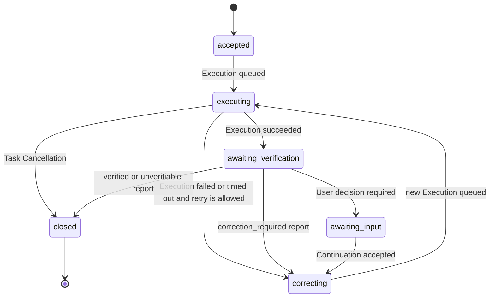

# Protocol-neutral Task Engine and adapter contract

Status: decision-complete planning contract

Date: 2026-07-12

Wayfinder ticket: [#27](https://github.com/AojdevStudio/hermes-satellite/issues/27)

## Decision

Hermes Satellite will have one protocol-neutral Task Engine. MCP, A2A, local transport, Cloudflare edge, and the future Managed Relay are adapters around that engine; none may define a second task lifecycle.

A **Task** is the stable User intent and acceptance criteria. It remains active through Hermes execution, independent verification, and corrective work. Each Hermes run is an immutable **Execution** beneath that Task. A materially changed objective creates a new Task in the same optional Context.

The Dispatcher owns the Satellite Verifier and all verification judgment. The Hermes Host owns execution and host-produced Evidence. The Task Engine accepts, validates, stores, and projects Verification Reports, but it never authors or revises their judgment. Co-location may change transport; it never changes these roles.

The first A2A posture is a Dispatcher-fronted inbound A2A server. The eventual posture is both server and client: the Dispatcher will later consume third-party A2A agents without changing Task Engine semantics.

This contract resolves the design requested by #27. It does not choose a database, process topology, Cloudflare service, SDK, or rollout plan.

## Evidence behind the decision

- The current bridge already exposes create, get, list, continue, cancel, execute, Evidence, cost, and event seams, but mixes them into one Python service. Its persisted queue is not restart-safe, cancellation is racy, callbacks are not durable, and task visibility is not principal-scoped. See [Task Engine seams](research/task-engine-seams.md).
- The completed A2A research shows that A2A 1.0 supplies agent discovery, task operations, streaming, polling, cancellation, and notifications, but not Hermes verification, transcript completeness, evidence tiers, or cost reconciliation. See [A2A protocol surface at commit 56581ca](https://github.com/AojdevStudio/hermes-satellite/blob/56581caad0d03176730f79df9e68b5ad3c9e5409/specs/research/a2a-protocol-surface.md).
- The Dispatcher workflow already defines submit, observe, retrieve transcript, decompose claims, perform a read-only oracle pass, issue a Verification Report, and continue corrective work. That existing product boundary is preserved rather than relocated.

## Responsibility boundary

| Component | Owns | Must not own |
|---|---|---|
| Dispatcher | User-facing dispatch, continuation decision, Satellite Verifier invocation, corrective-loop policy, A2A control surface | Hermes process supervision, host Evidence production |
| Satellite Verifier | Independent read-only judgment and signed/attributed Verification Reports | Task state mutation other than submitting a report; Hermes execution |
| Task Engine | Lifecycle rules, persistence, trace ordering, idempotency, authorization hooks, projections, Evidence references, report storage, Cost Records | Verification judgment; protocol-specific behavior |
| Hermes Host executor | Hermes process/session execution, result capture, host Evidence production, execution usage capture | Verification judgment; User-facing verified-completion claim |
| Protocol Adapter | Authentication translation, schema mapping, serialization, streaming/polling delivery | Lifecycle rules, separate state, hidden corrective semantics |
| Managed Relay | Principal routing, pairing, wake delivery, small control envelopes, delivery audit | New task semantics; transcript or repository storage by default |

## Canonical model

All identifiers are opaque, globally unique strings. Every mutation has an idempotency key and authenticated `PrincipalRef`. Every persisted entity carries `createdAt`, `schemaVersion`, and extension metadata. Mutable projections use optimistic versions; immutable records never update in place.

### PrincipalRef

Identifies the authenticated User, installation, device, service, Hermes executor, or Satellite Verifier responsible for an operation. A caller-provided display name is metadata, never authorization input. Exact pairing and policy live in the identity ticket, but the Task Engine contract requires a principal on every operation now.

### Context

An optional grouping for related Tasks and Messages. It has `contextId`, owner principal, optional title/metadata, and timestamps. Context does not carry task status, verification state, or Hermes session authority.

### Task

The stable unit of intent. It contains:

- `taskId`, optional `contextId`, owner principal, and creation principal;
- immutable original intent and acceptance-criteria references;
- a derived Task phase and optional terminal Task Outcome;
- latest Verification State projection;
- ordered references to Messages, Executions, Artifacts, Verification Reports, Cost Records, and Task Events;
- optional compatibility aliases for pre-migration bridge task IDs.

Task content is append-only. Corrective loops do not create child Tasks. Terminal Task Outcomes are immutable.

### Message

An immutable communication record with `messageId`, `taskId`, optional `contextId`, author principal/role, parts, timestamp, and optional `inReplyTo`. A User or Dispatcher Message may request an Execution. A Satellite Verifier Message can explain findings, but the structured Verification Report remains authoritative.

### Execution

One immutable Hermes run with `executionId`, `taskId`, triggering Message, executor principal, Hermes session reference, Execution Status, timing, result/error references, Evidence references, and Cost Record references. Corrective continuation creates another Execution in the same Task.

Execution Status is exactly:

`queued | running | succeeded | failed | cancelled | timed_out`

Execution success means Hermes returned successfully. It does not mean the Task is verified or terminal.

### Artifact and Evidence

An Artifact is an immutable or explicitly versioned reference with:

- `artifactId`, `taskId`, optional `executionId`, producer principal;
- name, media type, digest, byte size, storage locator, and availability;
- sensitivity, retention, authorization scope, and creation timestamp;
- optional supersedes/version relationship.

Bodies remain on the User-controlled machine by default. Adapters and the Managed Relay carry descriptors and authorized small payloads, not repository contents or transcript bodies by accident.

Evidence is an Artifact additionally carrying `evidenceTier`, provenance, completeness, capture method/time, and associated Execution. Verification Reports reference Evidence IDs and digests. A2A `Task.history` is never treated as verifier-grade transcript Evidence.

### Verification Report and Verification State

A Verification Report is immutable and contains:

- `verificationReportId`, `taskId`, verifier principal, and verification-pass ID;
- Executions, claims, and Evidence IDs examined;
- claim findings, unresolved claims, corrective recommendations, confidence, and confidence ceiling;
- structured judgment: `verified | correction_required | unverifiable`;
- timestamp, schema version, and integrity metadata.

The Task Engine accepts a report only from an authorized Satellite Verifier principal, stores it unchanged, emits a Task Event, and derives Verification State:

`not_started | pending | in_progress | correction_required | verified | unverifiable`

The Task Engine may reject an invalid or stale report. It may not upgrade, downgrade, reinterpret, or synthesize the verifier's judgment.

### Cost Record

A Cost Record is an immutable component record with `costRecordId`, `taskId`, optional `executionId` or verification-pass ID, producer, usage, currency, amount, pricing source/time, and basis:

`actual | estimated | subscription_included | unreconciled | unknown`

Task cost is a derived, itemized view over all execution and verification component records. Cumulative Hermes session snapshots are converted to deltas or represented as the latest cumulative snapshot; they are never blindly summed. Timeout and crash paths still emit an honest Cost Record, even when its basis is `unknown`.

### Task Event and Subscription

Every accepted state change appends an immutable Task Event with `eventId`, `taskId`, monotonic per-Task `sequence`, type, actor, occurred/committed timestamps, entity references, and payload metadata. The state mutation and event append are one atomic commit.

A Subscription is an at-least-once delivery view beginning after a cursor. Delivery may duplicate events. Consumers deduplicate by `eventId` and recover with `listEvents(afterCursor)`. Streams, callbacks, local IPC, and relay wakeups are delivery mechanisms only; the durable event log is the source of truth. Hermes Satellite does not claim exactly-once delivery.

## Lifecycle

Task phase is a derived product projection, not a substitute for the separate execution and verification axes:

`accepted | executing | awaiting_verification | correcting | awaiting_input | closed`

Task Outcome remains unset while useful work can continue. It becomes exactly one of:

`verified | failed | cancelled | unverifiable`

Rules:

1. A succeeded Execution moves the Task to verification; it never directly sets `TaskOutcome=verified`.
2. `correction_required` keeps the same Task active. The Dispatcher appends a corrective Message and requests a new Execution.
3. A continuation remains in the active Task only while original intent and acceptance criteria remain stable. A material objective change creates a new Task in the same Context. The Dispatcher chooses the route; the engine enforces terminal and authorization rules.
4. Execution Cancellation stops one queued/running Execution and leaves the Task open. Task Cancellation terminally abandons the intent, prevents new Executions, and cannot be overwritten by late process output.
5. Late executor results after cancellation remain trace events and Evidence candidates; they do not mutate the terminal Task Outcome.
6. `failed` is used when the objective cannot be completed under current retry/policy bounds. `unverifiable` is used when work may exist but independent assurance cannot be established.

## Command and query surface

The neutral interface is semantic, not language-specific.

| Operation | Kind | Required guarantees |
|---|---|---|
| `createTask` | command | principal-scoped; idempotent; persists intent, criteria, first Message, Task Event before dispatch |
| `getTask` | query | authorization-scoped snapshot with independent execution, verification, and outcome fields |
| `listTasks` | query | principal-scoped, filtered, cursor-paginated; never global by default |
| `continueTask` | command | active Task only; append Message; optional new Execution; idempotent |
| `requestExecution` | command | durable queue record before worker claim; idempotent; supports retry policy |
| `cancelExecution` | command | cannot cancel another Task; cancellation wins terminal race for that Execution |
| `cancelTask` | command | terminal and idempotent; prevents later executions and outcome overwrite |
| `recordArtifact` | command | producer-authorized; immutable descriptor; digest/integrity required when body exists |
| `submitVerificationReport` | command | authorized verifier only; immutable; stale-report check; engine does not alter judgment |
| `recordCost` | command | immutable component record; explicit basis; no implicit zero |
| `listEvents` | query | stable per-Task cursor and ordered replay |
| `subscribe` | query/delivery | at-least-once from cursor; current snapshot first when adapter requires it |

Every command returns the canonical entity snapshot and committed cursor. Adapters must pass an `expectedVersion` where concurrent mutation could change meaning.

## Restart and concurrency guarantees

The current in-memory thread queue is not the contract. An accepted Execution is durable before acknowledgement. Workers claim durable queue items with a lease/heartbeat or an equivalent recoverable ownership mechanism. On startup, the engine reconciles queued and orphaned-running Executions and records the recovery decision in Task Events.

Required behavior:

- retrying a command with the same principal, operation, and idempotency key returns the original result;
- only one active worker claim exists for an Execution;
- cancellation and worker completion resolve through one transition reducer, so `cancelled` cannot be overwritten by `failed`;
- crash recovery never silently loses accepted work or silently runs it twice;
- callbacks and streams may fail without losing the committed Task Event;
- retention is explicit across Tasks, Events, Executions, Artifacts, Reports, and Costs, with referential integrity.

The implementation may begin with SQLite, but SQLite tables are an implementation of this contract, not the contract itself.

## MCP adapter mapping

MCP remains supported for existing agent clients. The current tool names become compatibility methods over the neutral operations.

| MCP surface | Task Engine mapping | Compatibility decision |
|---|---|---|
| `hermes_submit` | `createTask` + initial `requestExecution` | accepts `caller` only as display metadata; identity comes from auth principal |
| `hermes_status` | `getTask` | returns separate Execution Status, Verification State, and Task Outcome |
| `hermes_result` | `getTask` + result Artifact descriptors | a Hermes result is not labeled verified without a valid report |
| `hermes_respond` | `continueTask` + optional `requestExecution` | canonical field is `message`; adapter may accept legacy `prompt` |
| `hermes_cancel` | `cancelTask` | add a distinct execution-cancel operation rather than overloading semantics |
| `hermes_list` | `listTasks` | principal-scoped and cursor-paginated |
| `hermes_transcript` | authorized Evidence Artifact retrieval | not derived from result prose |
| `hermes_task_cost` | Task cost projection + component Cost Records | includes the full correction/verification loop |
| polling/watcher/callback | `getTask`, `listEvents`, `subscribe` | callback is a wake adapter; cursor replay is recovery |

The adapter normalizes legacy `pending/running/completed/failed/cancelled` fields without preserving their ambiguity. Existing bridge task IDs become compatibility aliases while migration groups corrective child rows into one canonical Task with multiple Executions.

## A2A 1.0 adapter/profile

### Role and rollout

1. **First:** a Dispatcher-fronted A2A server exposes Hermes Satellite as a verified remote-execution agent. It translates A2A operations into the same Task Engine used by MCP.
2. **Later:** the Dispatcher also acts as an A2A client to delegate compatible work to external agents.
3. The Hermes Host is not the authoritative A2A surface for a Verified Result. Host execution completion remains only one input to Dispatcher-owned verification.

### Agent Card

The initial Agent Card declares:

- name: `Hermes Satellite`;
- description: remote Hermes execution with independent verification;
- A2A protocol version `1.0` and at least one supported JSON-RPC or HTTP+JSON interface;
- skill ID `verified-remote-execution`;
- streaming and push capabilities only when their delivery path passes conformance tests;
- security schemes and requirements matching the active Connectivity Mode;
- extension URI `urn:aojdevstudio:hermes-satellite:verification:v1`.

Breaking verification-extension changes require a new URI.

### A2A operation mapping

| A2A surface | Task Engine mapping |
|---|---|
| `SendMessage` | create or continue Task based on `taskId`/`contextId`; request Execution when applicable |
| `SendStreamingMessage` | same command plus Subscription delivery |
| `GetTask` | principal-scoped Task snapshot and bounded Message history |
| `ListTasks` | principal-scoped cursor pagination |
| `CancelTask` | Task Cancellation |
| `SubscribeToTask` | current snapshot followed by at-least-once Task Events |
| push notification config | delivery adapter over Task Events; never event persistence |
| `GetExtendedAgentCard` | authenticated capabilities, security, and Hermes extension details |

Core A2A states map as follows:

| Hermes state | A2A TaskState |
|---|---|
| accepted/queued | `SUBMITTED` |
| executing, awaiting verification, correcting | `WORKING` |
| User input needed | `INPUT_REQUIRED` |
| verified Task Outcome | `COMPLETED` |
| failed Task Outcome | `FAILED` |
| cancelled Task Outcome | `CANCELED` |
| unverifiable Task Outcome | `COMPLETED`, with explicit Hermes verification artifact showing `unverifiable` |
| authorization step needed | `AUTH_REQUIRED` |

`COMPLETED` means the A2A task has reached its terminal protocol state. Clients must inspect the Hermes verification artifact to distinguish `verified` from `unverifiable`; the Agent Card skill/profile states this rule explicitly.

### Namespaced artifacts

The verification extension uses separate, producer-attributed Artifacts:

- `application/vnd.aojdevstudio.hermes.verification-report+json`
- `application/vnd.aojdevstudio.hermes.evidence+json`
- `application/vnd.aojdevstudio.hermes.cost-record+json`

Host-produced Evidence and Dispatcher-produced Verification Reports never share producer identity. A2A history can aid interaction UX but cannot substitute for complete transcript Evidence.

## Connectivity invariants

The Task Engine contract is identical in every Connectivity Mode:

- **Local:** direct loopback or local IPC; Dispatcher/verifier and Host/executor may share a machine but remain separate roles and execution contexts.
- **Private:** user-owned private network reaches the authenticated origin.
- **Public Edge:** user-owned Cloudflare Tunnel and Access expose a loopback/private origin; Cloudflare is edge and identity translation, not Task Engine.
- **Managed:** AOJ Managed Relay routes authenticated control envelopes and wake events over an outbound Host connection; local Evidence bodies remain local by default.

No mode may require blind wildcard binding, global task listing, caller-string authorization, or a different definition of completion.

## Migration from the current bridge

1. Preserve current MCP behavior through an adapter while introducing canonical entities behind it.
2. Add stable principal ownership and scope every get/list/cancel/Evidence query.
3. Convert each current root task plus its corrective descendants into one canonical Task; convert every current task row/run into an Execution; retain old IDs as aliases.
4. Replace scattered SQL state writes with one lifecycle reducer and atomic Task Events.
5. Recover queued/orphaned Executions on startup and remove the cancellation overwrite race.
6. Convert callback delivery into an outbox/subscription adapter with acknowledgement/retry; retain polling/cursor replay.
7. Store Cost Records by component and derive whole-Task cost without summing cumulative session snapshots.
8. Wire the Dispatcher verifier so terminal Execution state produces Evidence retrieval and a separately authored Verification Report.
9. Add the Dispatcher-fronted A2A server only after adapter-parity and authorization tests pass.

## Conformance gates

The implementation is conformant only when automated tests prove:

1. MCP and A2A create the same canonical Task and expose equivalent lifecycle semantics.
2. A succeeded Execution cannot produce `TaskOutcome=verified` without an authorized Verification Report.
3. Corrective continuation produces a new Execution under the same Task; material objective changes can create a new Task in the same Context.
4. Duplicate submissions, continuations, reports, and cancellations are idempotent.
5. Restart recovery does not lose or duplicate accepted Executions.
6. Cancellation wins races against late worker completion and Task Cancellation is never overwritten.
7. Event replay from a cursor rebuilds the same Task Trace and tolerates duplicate delivery.
8. Principal A cannot list, read, cancel, or retrieve Evidence for Principal B's Task.
9. Artifact/Evidence bodies stay local unless an explicit authorized transfer is requested.
10. Cost projection preserves actual, estimated, subscription-included, unreconciled, and unknown bases.
11. The Agent Card and payloads validate against the A2A 1.0 normative proto/schema expectations and selected official SDK.
12. `unverifiable` is represented explicitly in the Hermes artifact and never mislabeled as verified completion.

## Deferred to mapped tickets

This contract intentionally supplies seams rather than deciding adjacent implementation details:

- Local process/IPC and co-location topology: [#28](https://github.com/AojdevStudio/hermes-satellite/issues/28)
- Connectivity-mode setup and migration: [#26](https://github.com/AojdevStudio/hermes-satellite/issues/26)
- Managed Relay transport, storage, and economics: [#30](https://github.com/AojdevStudio/hermes-satellite/issues/30)
- Pairing, principal mapping, and authorization policy: [#32](https://github.com/AojdevStudio/hermes-satellite/issues/32)
- End-to-end assurance ceiling: [#36](https://github.com/AojdevStudio/hermes-satellite/issues/36)

Those tickets may refine transport and policy but may not redefine the entities, role boundary, or completion semantics established here without reopening this contract.
